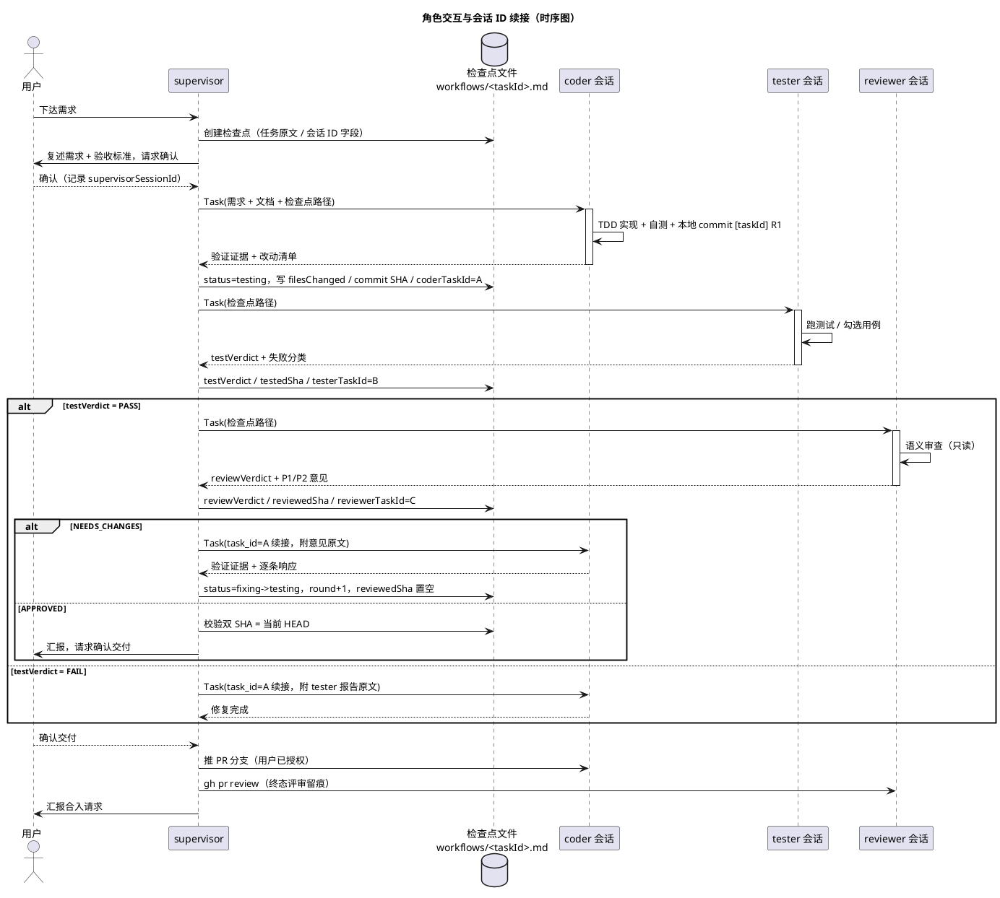

# 多 Agent 开发流程方案（Multi-Agent Development Workflow）

> 本文档是 `lab/.opencode/` 配置的权威设计文档：实现细节 + 设计依据（决策记录）。
> 内容已去掉具体项目属性，适用于任何目标项目；迁移到其他仓库/全局配置时随本目录整体搬迁。
> 版本：v2.1（2026-08-12，含首轮审阅修订与流程图）

---

## 1. 概述

### 1.1 目标

搭建一套自动化的多 Agent 开发流程：**实现 → 测试 → 审查 →（修复）→ 循环 → 交付**。
用户只下达需求，流程内部分工由 4 个 Agent 协作完成，全程可在 opencode TUI 中观察和打断。

### 1.2 核心原则

| # | 原则 | 来源 |
|---|---|---|
| P1 | 触发可以自动，授权不能自动（主分支 push/merge 必经用户确认） | clowder F253 金规 |
| P2 | 没有失败的测试，就没有实现代码（TDD 铁律） | clowder tdd skill |
| P3 | NO COMPLETION CLAIMS WITHOUT FRESH VERIFICATION EVIDENCE（声称完成必须附命令输出） | clowder quality-gate skill |
| P4 | 禁止表演性同意（对意见逐条响应：已修 / 拒绝+论证） | clowder receive-review skill |
| P5 | 测试全绿是 review 的前置条件（机械验证在前，语义审查在后） | clowder request-review skill |
| P6 | 机械层确定性，判断层留模型（调度/状态机是确定性逻辑，语义判断交给 LLM） | clowder @提及路由系统 |
| P7 | 通信走会话内直连，检查点文件只存档、只在恢复时读 | 本文档 D3 |

---

## 2. 架构

### 2.1 角色总览

```
用户指令
   │
   ▼
supervisor（编排者，便宜模型）
   │  ① 需求确认（复述需求+验收标准，用户确认后才开工）
   │  ② Task 调用（会话内直连，复用 task_id 保持子会话上下文）
   ├─▶ coder（实现者）：实现 + TDD 自测，只碰业务/测试代码
   ├─▶ tester（验证执行者）：用例文档 → 可执行测试 + 验收勾验
   └─▶ reviewer（审查者）：语义审查 + CASE_BUG 裁定 + 终态 PR 评审，全只读
   │
   ├─ 每轮关键节点 ──写──▶ .opencode/workflows/<task>.md（检查点）
   │
   ▼ 全部通过（双 verdict + 双 SHA = 当前 HEAD）→ 用户确认
   │
   ▼ 交付阶段：coder 推 PR 分支 → reviewer gh pr review → evidence manifest 写 PR description
```

### 2.2 角色职责矩阵

| 角色 | mode | 职责 | 不做 |
|---|---|---|---|
| supervisor | primary | 需求确认、调度、写检查点、传意见、收敛保护 | 写代码、测试、审查 |
| coder | subagent | 实现需求、TDD 自测、按意见修复 | 改验收用例/设计文档、推主分支、merge |
| tester | subagent | 用例文档→可执行测试、跑验证、里程碑勾验 | 改业务代码、改用例文档 |
| reviewer | subagent | 语义审查、CASE_BUG 裁定、终态 PR 评审 | 改任何代码 |

### 2.3 职责边界的核心设计

借鉴 clowder F253 的三层分离：**tester/reviewer 只产出验证结论，不修改业务代码**。

- tester 拥有 `edit` 权限但限定测试文件路径（`**/tests/**`、`**/test/**`、`**/*.test.*`、`**/*.spec.*`，glob 支持 workspace 多 crate 场景）
- reviewer `edit: deny`，bash 只放行只读 git 命令 + gh 只读/评审命令
- 测试用例文档（如 `TEST-CASES.md`）是**验收依据，等同需求**：tester 发现"用例预期与实际矛盾"时不能自己改，报告 supervisor 后由 reviewer 裁定
- reviewer 兼任 CASE_BUG 裁定与终态 PR 评审（见 D18）：两者均为顺带职责，不扩大审查主循环的上下文负担

---

## 3. 配置布局

### 3.1 文件结构

```
.opencode/
├── README.md               # 本文档
├── agent/
│   ├── supervisor.md       # 编排者（primary）
│   ├── coder.md            # 实现者（subagent）
│   ├── tester.md           # 验证执行者（subagent）
│   └── reviewer.md         # 审查者（subagent）
├── workflows/              # 检查点存档
│   └── _template.md        # 检查点模板
```

### 3.2 放置位置与加载规则

**opencode 的配置加载规则**：从启动时的 cwd 向上到 git worktree root，只加载该范围内的 `opencode.json` / `.opencode/`。

- 本配置放在 **仓库根**（worktree root），从仓库根启动 opencode 即生效
- ⚠️ 若放在子项目目录（如 `pulse-pet/.opencode/`），从仓库根启动时**不会被扫描到**，必须 `cd` 进子目录启动才生效
- 检查点文件是运行时数据（supervisor 用 edit 工具读写普通文件），不受加载规则限制，统一放 `workflows/` 管理，且已 gitignore（含敏感信息时不入库，diff 不污染）

### 3.3 模型分配（可替换，改 agent 文件 frontmatter 的 `model:` 即可）

| 角色 | 模型 | 定位理由 |
|---|---|---|
| supervisor | `deepseek/deepseek-v4-flash` | 只做调度与状态机，便宜快 |
| coder | `opencode-go/deepseek-v4-pro` | 主力实现，能力强 |
| tester | `deepseek/deepseek-v4-flash` | 跑命令+写测试为主，便宜；质量不足可升级 |
| reviewer | `opencode-go/glm-5.2` | 独立模型族，审慎推理（跨族盲点正交，见 D11） |

> 模型 ID 已用 `opencode models` 验证存在（2026-08-12）。⚠️ subagent 不显式写 `model` 会**继承调用者的模型**，三个 subagent 必须各自写死。

---

## 4. 工作流详细设计

### 4.1 主流程状态机

```
created ──写入任务原文──▶ spec_confirm ──用户确认──▶ implementing
implementing ──coder 返回──▶ testing
testing ──tester FAIL──▶ fixing（round+1）──回 coder──▶ implementing
testing ──tester PASS──▶ reviewing
reviewing ──NEEDS_CHANGES──▶ fixing（round+1）──回 coder──▶ implementing
reviewing ──APPROVED 且双 SHA=HEAD──▶ approved ──用户确认──▶ 交付阶段 ──▶ done
任何状态 ──超轮/乒乓──▶ blocked（endReason=max_rounds / ping_pong，上报用户接管）
任何状态 ──用户放弃──▶ cancelled（endReason=user_cancelled，保留检查点）
```

**fixing 语义**：tester FAIL 或 reviewer NEEDS_CHANGES 后、回 coder 之前，supervisor 必须显式置 `status=fixing` 并 `round+1`、`reviewedSha` 置空——fixing 是"待修复"的暂存态，coder 重跑后流转回 implementing。

#### 4.1.1 流程全景（活动图）

> 下方为可编辑的 PlantUML 源码（VS Code 装 PlantUML 插件后自动渲染；渲染方法见仓库根 AGENTS.md「PlantUML 渲染」节）。

```puml
title 多 Agent 开发流程全景（活动图）

start
:用户下达需求;
:supervisor 创建检查点\n(status=spec_confirm，写入任务原文);
:复述需求 + 验收标准，请求用户确认;
if (用户确认?) then (否)
  :按用户意见更新任务原文;
endif
:status=implementing，\n调 coder（Task 首次调用）;

while (任务未通过 且 未终止?) is (循环中)
  :coder TDD 实现 + 自测;
  if (验证证据完整 且 已本地 commit?) then (否)
    :打回 coder 重跑;
  else (是)
    note right
      commit 格式 [taskId] R<n>
      HEAD 前进 -> SHA 校验生效
    end note
    :status=testing\n写检查点（文件清单/commit SHA/会话 ID）;
    :调 tester（续接 testerTaskId）;
    if (tester 结果?) then (FAIL)
      if (失败分类?) then (TEST_BUG)
        :tester 修测试重跑;
      else (IMPL_BUG)
        :status=fixing，round+1;\n意见原文逐字给 coder;
      endif
    else (PASS)
      :status=reviewing 写检查点;\n调 reviewer（续接 reviewerTaskId）;
      if (reviewVerdict?) then (NEEDS_CHANGES)
        :status=fixing，round+1;\n意见原文逐字给 coder;
      else (APPROVED)
        if (双 SHA = 当前 HEAD?) then (否)
          :verdict 回退，回到相应阶段重验;
        else (是)
          break
        endif
      endif
    endif
  endif
  if (round > maxRounds 或 同问题往返>=2?) then (是)
    :status=blocked（endReason）\n上报用户接管;
    if (用户决策?) then (放弃)
      :status=cancelled，保留检查点;
      stop
    else (继续 / 人工接管)
      :按用户指示处理;
    endif
  endif
endwhile (终止)

:status=approved，向用户汇报并询问交付;
if (用户确认?) then (否)
  :保持 approved 待命;
else (是)
  :交付阶段：coder 推 PR 分支;
  :reviewer gh pr review 留痕;
  :evidence manifest 写入 PR description;
  :汇报合入请求（用户确认后合入）;
endif
stop
```

> 中断恢复：任何状态均可中断，重启后 resume 主会话（supervisorSessionId），supervisor 读检查点按 status 从断点继续（恢复语义见 §4.3 表格）。

### 4.2 每轮迭代顺序（为什么 tester 在 reviewer 前：D5）

```
coder 修复/实现（TDD + 验证证据小节）→ 自测通过 → 本地 commit（[taskId] R<n>）
  → tester 验证（机械、便宜、确定性）→ FAIL 直接回 coder（不浪费 reviewer）
  → PASS → reviewer 语义审查（贵、模型推理）
  → NEEDS_CHANGES → 回 coder
  → 修复后 tester 先回归（防 stale）→ reviewer 复看
```

### 4.2.1 提交节点（D20）

| 节点 | 动作 | 说明 |
|---|---|---|
| 每轮 coder 完成后 | **本地 commit**（`[<taskId>] R<n>`） | 不 push；使 HEAD 前进，`testedSha`/`reviewedSha` 校验生效；崩溃可 `git log` 回溯轮次 |
| 用户确认交付后 | coder 推 **PR 分支** | 唯一 push 节点，用户已确认 |
| 合入 | 用户确认后由 supervisor 执行（`bash: ask`） | 不自动合入 |

- 本地 commit 不违反"授权不能自动"（P1）：commit 不发布，push 才需授权
- coder 权限已 deny 主分支 push（D15），PR 分支 push 在交付阶段才被指示执行

### 4.3 检查点文件（防中断恢复）

**位置**：`.opencode/workflows/<task-id>.md`

```markdown
---
taskId: task-001
target: <目标项目目录>      # coder/tester/reviewer 以此作为工作根
supervisorSessionId: null   # supervisor 所在的 opencode 会话（恢复时 resume 主会话用）
coderTaskId: null           # Task 工具返回的 coder 会话 ID（续接用，见 §4.3.1）
testerTaskId: null          # 同上，tester
reviewerTaskId: null        # 同上，reviewer
status: reviewing           # created→spec_confirm→implementing→testing→reviewing→fixing→approved→blocked→cancelled→done
round: 2
maxRounds: 3
testVerdict: PASS
reviewVerdict: NEEDS_CHANGES
testedSha: a1b2c3d
reviewedSha: a1b2c3d        # 修复后置空，待重审
filesChanged: ["src/lib/events.rs", "src/store/usePetStore.ts"]
endReason: null             # blocked/cancelled 时记录原因
updatedAt: 2026-08-11T10:30:00+08:00
---

# task-001: 任务标题

## 任务原文
（需求 + 验收标准，写全——这是恢复时唯一的上下文来源）

## 需求确认
- [ ] 用户已确认

## 轮次记录
- R1: coder 完成（改动…，自测：cargo test 12/12 通过）
- R1: tester PASS（TC-EV-01~05 通过）
- R1: reviewer NEEDS_CHANGES（P1×1: src/lib/events.rs:42 …）

## 最新验证意见原文
（tester/reviewer 报告逐字保留——恢复时给 coder 的修复依据）
```

**写入时机**（supervisor 每轮节点落盘；tester/reviewer 无写权限，天然由 supervisor 代写）：

| 节点 | status | 写入内容 |
|---|---|---|
| 创建 | spec_confirm | 任务原文 |
| 用户确认 | implementing | 确认标记 |
| coder 返回 | testing | 文件清单、验证证据、commit SHA（= HEAD，每轮本地 commit 后取） |
| tester 返回 | reviewing / fixing | testVerdict + testedSha + 报告原文 |
| reviewer 返回 | fixing / approved | reviewVerdict + reviewedSha + 意见原文 |
| 新一轮修复开始 | fixing → implementing | round+1，reviewedSha 置空 |
| 超轮/乒乓 | blocked | endReason |
| 用户放弃 | cancelled | endReason |

**恢复语义**（借鉴 clowder F048：cancel old + replay new）：

| 中断时 status | 恢复动作 |
|---|---|
| spec_confirm | 复述需求重新请求用户确认 |
| implementing | coder 重做该轮（SHA 校验：改了一半的文件回滚） |
| testing | 从 tester 继续 |
| reviewing | 校验 reviewedSha vs HEAD：一致→reviewer 继续；不一致→回 implementing 重做修复轮 |
| fixing | 校验 testedSha vs HEAD：一致→直接从 reviewer 继续；不一致→coder 重做修复 |
| blocked / cancelled | 不自动继续，等待用户指示 |

### 4.3.1 会话 ID 管理

一项任务内，coder / tester / reviewer **各自始终只维持一个 Task 会话**（对应检查点中的 `coderTaskId` / `testerTaskId` / `reviewerTaskId`，即 Task 工具返回的 task_id）：

- **首次调用**：Task 调用后把返回的 task_id 写入检查点
- **二次调用**：必须携带对应 task_id 续接同一会话（coder 记得自己上一轮的实现与思路；tester 记得自己写过的测试；reviewer 记得自己提过的意见），**禁止新开**
- **续接失败**（进程重启 / compaction 导致会话失效）：新开会话，更新检查点中的 task_id，并告知该角色"从检查点文件恢复上下文"
- **supervisor 自身**：主会话由 opencode session 管理，记录到 `supervisorSessionId`（中断后用户据此 resume 主会话），未知则留空
- 会话 ID 是"每轮节点写入检查点"的一部分：每次 Task 调用后立即更新

> 业务 ID（`taskId`，1 任务 = 1 检查点文件）与 Task 会话 ID（`coderTaskId` 等，1 角色 = 1 会话）是两层 ID，不要混淆。任务会创建 1 个检查点文件 + 最多 4 个会话 ID。

**协议铁律**（写入 supervisor prompt）：正常流程每轮节点只写、恢复时先读、状态只能前进、检查点文件是唯一权威。

#### 4.3.2 角色交互与会话 ID 续接（时序图）

> 下方为可编辑的 PlantUML 源码（VS Code 装 PlantUML 插件后自动渲染；渲染方法见仓库根 AGENTS.md「PlantUML 渲染」节）。



### 4.4 意见传递协议（D7）

- supervisor 将 tester/reviewer 报告**逐字原文**传给 coder，不做语义汇总、不删减
- coder 对每条意见逐条响应：**已修（附证据）/ 拒绝（附技术论证）**，禁止表演性同意

### 4.5 任务终止与放弃

- **用户中途放弃**：告知 supervisor"放弃任务 <task-id>" → 置 `status=cancelled`、`endReason=user_cancelled` → 检查点保留 30 天供审计（supervisor 记录创建时间，超期后可清理）
- **超轮/乒乓**：置 `status=blocked` + endReason → 停止循环 → 上报用户，用户决定"继续（提高 maxRounds）/ 放弃 / 人工接管"
- 已 approved 但用户不确认交付：保持 approved 状态，检查点不删除

---

## 5. 质量门禁体系

借鉴 clowder F253 QC Loop 的分层：

```
① coder TDD 自测（L1 机械）→ 必须输出"验证证据"小节（命令 + 输出摘要），缺失打回
② tester 验收执行（L2 机械+模型）→ testVerdict + 失败分类（IMPL_BUG / TEST_BUG / CASE_BUG）
③ reviewer 语义审查（L3 模型）→ 只给 finding 不改码，reviewVerdict
④ evidence manifest（交付阶段）→ 写 PR description（机器可读 JSON）
⑤ stale 保护 → 双 SHA ≠ 当前 HEAD 时 verdict 自动回退，强制重验
⑥ 收敛保护 → 超 3 轮或同问题往返 ≥2 次，supervisor 停循环上报用户
```

### 5.1 tester 失败分类协议

| 分类 | 含义 | 处理 |
|---|---|---|
| IMPL_BUG | 实现与用例预期不符 | 报给 coder 修 |
| TEST_BUG | 测试自身错误（mock/断言） | tester 自己修测试重跑 |
| CASE_BUG | 用例预期与实际行为矛盾 | 报告 supervisor，**用例=需求，改动必须经 reviewer 裁定** |

### 5.2 evidence manifest（交付时写入 PR description）

```json
{
  "head": "abc1234",
  "testedSha": "abc1234",
  "reviewedSha": "abc1234",
  "testVerdict": "PASS",
  "reviewVerdict": "APPROVED",
  "gate_commands": ["cargo test", "npx vitest run", "npm run build"],
  "stale": false
}
```

---

## 6. 护栏与收敛保护

| 护栏 | 实现 |
|---|---|
| 最大轮次 | maxRounds=3，超轮 → blocked（endReason=max_rounds） |
| 乒乓检测 | 同问题往返 ≥2 次 → blocked；**启发式**：supervisor 按意见主题做语义比对，POC 阶段观察误判率（D19） |
| 授权闸门 | supervisor `bash: ask`（只放行只读 git）；coder 禁止推主分支/merge/remote 变更/危险清理 |
| 权限隔离 | tester 只能写测试路径；reviewer 全只读 |
| gh 环境 | agent prompt 注明 gh 不在默认 PATH，需先 `export PATH=...` |

### 6.1 各角色 bash 权限一览

| 角色 | 放行 | 拦截/询问 |
|---|---|---|
| supervisor | git status/log/diff/rev-parse | 其余全部 ask（含 push/merge） |
| coder | 全部 | 推主分支（develop/main）、merge、remote 变更、reset --hard、clean、rm -rf（deny） |
| tester | 只读 git（含 rev-parse）+ cargo/npm/pnpm/npx/yarn/bun 全族 | 其余 ask |
| reviewer | 只读 git（diff/status/log/show/rev-parse）+ gh pr diff/view/review/comment/api | 其余 deny |

---

## 7. 使用指南

1. 在仓库根启动 opencode（配置加载前提）
2. Tab 切换到 supervisor 直接下达"目标项目与需求"
3. supervisor 会先**复述需求请求确认**，确认后开始循环；push/merge 时 opencode 会弹出确认
4. **中断恢复**：重启 opencode → 重新进入 supervisor → 输入"继续任务 <task-id>" → supervisor 读检查点按 §4.3 恢复语义继续
5. **放弃任务**：告诉 supervisor"放弃任务 <task-id>"
6. 观察点：检查点文件 `workflows/<task-id>.md` 实时更新

---

## 8. 设计依据（决策记录）

> 本文档由 2026-08 的多轮讨论与首轮审阅沉淀。D1-D12 为初版决策，D13-D19 为审阅修订决策。

### D1. 为什么不用 GitHub Issue/PR 作为 agent 间通信媒介

**结论：被否决。** GitHub Issue/PR 属于"异步强解耦"方案，固有缺陷：

- **协作效率低、延迟高**：每轮交互经过 Git 提交/推送/API 读写/Webhook 回调，单轮延迟比会话内直连高几十倍
- **信息损耗严重、上下文割裂**：Issue/PR 只能传格式化文本，无法携带开发思路/调试过程/中间决策；Reviewer 只看最终 Diff，容易脱离实际约束提意见；评论链过长导致上下文过载
- **状态同步复杂**：需额外维护状态机与 GitHub 状态、Agent 会话状态对齐，易出现"coder 已改但 supervisor 未感知""reviewer 重复审旧版本"等不一致
- **易陷入无效循环**：需求边界不清时 agent 缺乏人类共识能力，在非核心细节上无限迭代
- **成本与限流**：独立会话 token 消耗高，高频 GitHub API 调用触发限流

**替代结论**：GitHub 只做**最终交付与归档**（PR + evidence manifest + gh pr review 留痕），不做通信。

### D2. 为什么选 supervisor 编排 + subagent 分工，而非其他形态

| 方案 | 结论 |
|---|---|
| build 自驱动（command + reviewer subagent） | 循环逻辑混在 build 代理里，写代码的同时还要记得调 reviewer，易跑偏 |
| **supervisor 编排 + 3 个 subagent（选定）** | 编排抽成独立角色，职责清晰，各角色模型独立指定，符合 clowder 推荐的多 agent 协作模式 |
| SDK 脚本硬编排 | 可靠性最强但开发成本高、不可观察；适合未来把跑通的流程固化成 CI 脚本，作为演进方向 |

### D3. 为什么通信走会话内直连 + 检查点文件

- **会话内直连**：review 意见零损耗传递，多轮迭代上下文完整，延迟最低
- **检查点文件**：解决"网络不稳定/进程中断"的恢复问题。每轮只写不读，仅在崩溃恢复时读，开销≈0
- 借鉴 clowder F048（restart recovery）：状态必须持久化，通信仍走消息层。**"状态存档"与"通信"是两回事**
- 相比 opencode 自带 session 持久化：session 恢复能拿回对话历史，但 subagent 子会话中间状态会丢、上下文可能被 compaction 洗掉细节；检查点文件是显式的权威状态，恢复不依赖模型记忆

### D4. 为什么设置 tester 角色（对比 clowder 无独立 tester 的设计）

clowder 没有独立 tester：测试是 coder 自己的 TDD 铁律。其反对独立 tester 的核心论据是"测试有效性依赖对实现意图的理解，分离角色引入上下文损耗"。

**本方案保留 tester，理由是**（目标项目特性改变了论据前提）：

- **验收用例文档已存在且结构化**（编号到具体步骤+预期、对应里程碑）——测试意图已固化在文档里，tester 不需要猜 coder 意图
- **双技术栈**（如 Rust + React/TS）：测试设施要建两套（cargo test + vitest），工程量真实存在
- **里程碑验收制**：需要持续的"验收执行者"逐条勾验并输出报告
- **独立验证视角**：避免"验证自己写的东西"的动机偏差；跨模型盲点正交（clowder F253 reviewer delta 理论）

**防走样的约束**：coder 仍保留 TDD 铁律（自测核心逻辑），tester 管**验收级验证**；tester 不写业务代码、不修改用例文档。

### D5. 为什么 tester 在 reviewer 之前（顺序问题）

如果先 review 再测试：tester 发现测试挂 → coder 修 → **reviewer 的审查作废**（HEAD 变了，F253 叫 stale invalidation），浪费一轮模型推理。

正确顺序：**机械验证（便宜、快、确定性）先挡低级错误，语义审查（贵）只审"能跑的代码"**。修复后同样：tester 先回归，reviewer 再复看。clowder 的 request-review skill 实证："测试全绿是发 review 的前置条件（BLOCKED — 修到绿灯再发）"。

### D6. 为什么分层（三层分离）

借鉴 clowder F253 的 3-Layer Reviewer Split：**L1 确定性工具/机械验证 → L2 审查者只产出 finding → L3 final approver 确认 final HEAD 覆盖全部 finding**。消除"审查者顺手改代码导致审查记录断裂"的问题。

本方案映射：tester（L1 机械验证）→ reviewer（L2 只给 finding）→ 终态双 SHA 校验（L3 等价）。

### D7. 为什么意见逐字传递，不做 supervisor 语义汇总

clowder receive-review 协议：author 对意见逐条响应（已修/拒绝+论证，禁止表演性同意）。语义汇总引入 supervisor 的中间判断层，是新的损耗和分歧源。**supervisor 只做机械传递 + 状态机，判断留给角色**（P6）。

### D8. 为什么授权不能自动

clowder F253 金规："QC 触发可以自动，授权不能自动"。不自动 push、不自动 merge、不自动 bypass 审查。主分支 push/merge 是仓库历史不可逆操作，必须经过用户确认（supervisor `bash: ask`）。

### D9. 为什么需要收敛保护

更多验证者 = 更容易卡死。借鉴 clowder：F167 乒乓检测（同一对 agent 反复弹跳注入警告）、F253 触发策略（同类 finding 连续 ≥3 轮退回 plan/spec 层）。本方案：maxRounds=3 + 同问题往返 ≥2 次上报用户。

### D10. 为什么配置先放项目级而非全局

POC 阶段先在单仓库验证效果（模型配合、prompt 质量、检查点协议），效果好再迁移全局 `~/.config/opencode/`。项目级配置与仓库自包含原则一致（每个 App 独立可运行）。

### D11. 为什么 reviewer 选独立模型族

clowder F253 的"盲点正交性"：不同模型族有不同系统性盲点，跨族 review 比同族 fresh-context 多捕获的 finding（reviewer delta metric）更高。故 reviewer 用与 coder 不同族、审慎型的模型（如 glm-5.2），而非同族强模型。

### D12. 从 clowder 借鉴的设计清单

| clowder 机制 | 本方案落点 |
|---|---|
| @提及路由（行首 @handle = 路由指令） | supervisor 用 Task 工具显式调度，subagent 名称即路由目标 |
| 上下文组装（身份 + 队友花名册 + directMessageFrom） | supervisor 每次调用注入：检查点路径 + 需求文档路径 + 上下文包 |
| 乒乓检测 | maxRounds + 同问题 2 次上报（启发式） |
| F253 QC Loop 分层 | §5 质量门禁体系 |
| evidence manifest + stale invalidation | 检查点双 SHA 字段 + 终态校验 |
| F048 restart recovery | 检查点文件 + 恢复语义表 |
| receive-review 逐条响应协议 | §4.4 意见传递协议 |
| request-review 五件套（gate 报告/测试输出/需求引用/架构归属/实测证据） | 检查点中的"任务原文 + 验证证据 + 意见原文"，构成 review 的完整上下文包 |
| TDD 铁律 / quality-gate 证据原则 | coder/tester prompt 铁律（P2/P3） |
| 金规：触发可自动、授权不能自动 | supervisor `bash: ask` + coder 主分支 push deny |

### D13. 需求确认节点（审阅新增）

原设计把用户 `$ARGUMENTS` 直接当需求交给 coder，需求歧义时全部轮次可能耗在错误方向。修订：supervisor 创建检查点后**先把"需求 + 验收标准"复述给用户请求确认**，确认后才开工（新增 `spec_confirm` 状态）。代价是每任务多一次交互，换取方向正确性。

### D14. tester 权限适配（审阅新增）

- `edit` glob 修正为 `**/tests/**`、`**/test/**`、`**/*.test.*`、`**/*.spec.*`：前缀通配保证 workspace 多 crate 场景（`crates/*/tests/`）也能匹配；初版 `test/**` 只匹配根目录级，是缺陷
- `bash` 白名单从枚举命令改为**族级匹配**（`cargo *`、`npm *`、`pnpm *`、`npx *`、`yarn *`、`bun *`）：不再随项目脚本演化补名单；补充 `git rev-parse*`（写 testedSha 必须）
- 技术栈适配：tester 从目标项目根读 Cargo.toml / package.json 判断栈；当前白名单覆盖 **JS/TS + Rust** 栈（见 §9 限制声明）

### D15. coder 权限收紧（审阅新增）

初版 coder `bash: allow` 全开，可自主 push/merge/改仓库配置，与"授权不能自动"矛盾。修订（deny 列表，opencode 权限"最后匹配生效"，deny 置于 allow 之后）：

- 推主分支（`git push origin develop*` / `git push origin main*`）deny——PR 分支推送仍允许（交付阶段经用户确认）
- `git merge*`、`git remote*`、`git reset --hard*`、`git clean*`、`rm -rf*` deny

### D16. opencode 能力验证结论（审阅新增）

审阅质疑的 frontmatter 字段与能力，均已对照官方文档（docs/agents）与本环境验证：

| 疑点 | 结论 | 证据 |
|---|---|---|
| `mode: primary / subagent` | ✅ 支持，枚举 `primary | subagent | all` | docs/agents.md |
| `permission.task` 限制到 agent 名称 | ✅ 支持 glob 匹配（官方示例 `{"*": "deny", "code-reviewer": "ask"}`） | docs/agents.md Task permissions 段 |
| `bash: ask` 在交互式调用链 | ✅ 支持，TUI 下向用户弹权限确认 | docs/agents.md / docs/permissions.md |
| Tab 切换 primary agent | ✅ 支持（"You can cycle through them using the Tab key"） | docs/agents.md |
| Task 工具 task_id 续接 subagent 会话 | ✅ 支持（Task 工具签名含 task_id 参数，可续接同一子会话） | 本环境工具定义 |
| 三个模型 ID | ✅ 均存在（初版曾误写 `opencode/deepseek-v4-pro`，该 ID 不存在；已修正为 `opencode-go/deepseek-v4-pro`） | `opencode models`（2026-08-12） |

> 备注：subagent 内触发 `ask` 时权限请求会冒泡到 TUI 用户确认；"task_id 续接在 compaction 后上下文保留程度"需 POC 首跑实测（检查点文件是最终兜底）。

### D17. 任务终止与清理（审阅新增）

初版无终止流程。修订：新增 `blocked`（超轮/乒乓，endReason 记录）与 `cancelled`（用户放弃）终态；放弃任务保留检查点 30 天供审计；supervisor 记录创建时间以便超期清理。

### D18. reviewer 职责范围（审阅新增）

审阅指出 reviewer 兼任 L2 审查 + CASE_BUG 裁定 + 终态 PR 评审三个职责。修订决策：**保留三职责，但约束其边界**——CASE_BUG 裁定只在 tester 提交时处理（不主动扩大范围）、终态 PR 评审只在交付阶段触发；裁定与 PR 评审均为顺带职责，主循环上下文以语义审查为限。若 POC 出现上下文膨胀，再拆分独立 approver 角色（clowder 3-Layer 原案）。

### D19. 乒乓检测的启发式性质（审阅新增）

"同一问题往返 ≥2 次"依赖 supervisor 对意见主题的语义比对，可能误判（不同意见判为同一）或漏判（同一问题换了措辞）。已注明为启发式，POC 阶段观察误判率；若不可靠，回退为纯 maxRounds 保护。

---

### D20. 提交节点：循环内每轮本地 commit，push 仅限交付阶段（审阅后修正）

初版设计"循环内不提交"存在逻辑缺陷：HEAD 不变则 `testedSha`/`reviewedSha` 全程一致，**stale 校验失效**，恢复语义中的 SHA 回滚判断也无从谈起。修正：

- **每轮 coder 完成后本地 commit**（`[<taskId>] R<n>`）：HEAD 前进使双 SHA 校验真正生效（修复轮 commit 后，上一轮 verdict 自动 stale）；崩溃恢复可 `git log` 回溯已完成轮次
- **push 仅发生在交付阶段**（用户确认后推 PR 分支）：本地 commit 不发布，不违反"授权不能自动"（P1/D8）
- coder 权限 deny 主分支 push（D15）与此一致：PR 分支 push 是交付阶段被指示的授权操作

---

## 9. 已知限制与后续演进

### 限制

- **循环可靠性是软约束**：协议依赖模型遵循 prompt（检查点写坏最坏重跑一轮，可接受）
- **乒乓检测是启发式**：语义比对可能误判/漏判（D19）
- **支持技术栈受限**：tester/bash 白名单覆盖 **JS/TS（npm/pnpm/yarn/bun/npx）+ Rust（cargo）**；引入其他栈（Python/Go/Swift）需先扩展 tester 权限与测试命令
- **模型质量依赖**：tester 用便宜模型写测试，质量不足时需升级模型或由 reviewer 兜底审查测试质量
- **平台验证受限**：本地只能验证当前平台行为（如 macOS），跨平台行为靠 CI/手动
- **检查点文件漂移风险**：文件与代码短暂不一致，靠双 SHA 校验兜底
- **需求确认代价**：每任务多一次用户交互（换取方向正确性）

### 演进方向

1. 效果验证通过后，整体迁移全局配置 `~/.config/opencode/`
2. 用 `@opencode-ai/sdk` 将流程固化为脚本（硬循环 + structured output），支持 CI/无人值守
3. 每轮写检查点时生成 evidence manifest，交付阶段自动组装进 PR description（可脚本化）
4. 支持多技术栈时，引入 per-target 测试命令配置（如 `opencode-test-config.json`），替代静态 bash 白名单
