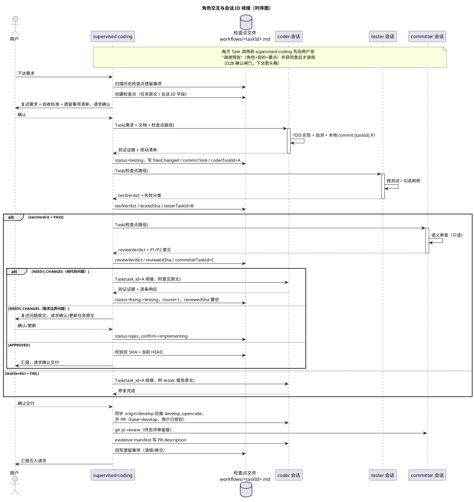

# 多 Agent 开发流程方案（Multi-Agent Development Workflow）

> 本文档是 `lab/.opencode/` 配置的权威设计文档：实现细节 + 设计依据（决策记录）。
> 内容已去掉具体项目属性，适用于任何目标项目；迁移到其他仓库/全局配置时随本目录整体搬迁。
> 版本：v10（2026-08-16，九轮修订：D37 tester bash 权限反转为默认放行 + 定向拦截（git 写全禁），栈限制解除；八轮见 D36，七轮见 D35，六轮见 D32-D34，五轮见 D31，四轮见 D28-D30，前三轮见 D15/D26-D27）

---

## 1. 概述

### 1.1 目标

搭建一套自动化的多 Agent 开发流程：**实现 → 测试 → 审查 →（修复）→ 循环 → 交付**。
用户只下达需求，流程内部分工由 4 个 Agent 协作完成，全程可在 opencode TUI 中观察和打断。

### 1.2 核心原则

| # | 原则 | 来源 |
|---|---|---|
| P1 | 触发可以自动，授权不能自动（主分支 push/merge 必经用户确认） | clowder F253 金规 |
| P2 | 没有失败的测试，就没有实现代码（TDD 铁律） | clowder tdd skill |
| P3 | NO COMPLETION CLAIMS WITHOUT FRESH VERIFICATION EVIDENCE（声称完成必须附命令输出） | clowder quality-gate skill |
| P4 | 禁止表演性同意（对意见逐条响应：已修 / 拒绝+论证） | clowder receive-review skill |
| P5 | 测试全绿是 review 的前置条件（机械验证在前，语义审查在后） | clowder request-review skill |
| P6 | 机械层确定性，判断层留模型（调度/状态机是确定性逻辑，语义判断交给 LLM） | clowder @提及路由系统 |
| P7 | 通信走会话内直连，检查点文件只存档、只在恢复时读 | 本文档 D3 |

---

## 2. 架构

### 2.1 角色总览

```
用户指令
   │
   ▼
supervised-coding（编排者，便宜模型）
   │  ⓪ 遗留事项检查（扫历史检查点，未了结事项默认并入本任务，D29）
   │  ⓪.5 需求确认（复述需求+验收标准+遗留事项清单，用户确认后才开工）
   │  ⓪.8 调用预告（每次调 subagent 前先向用户确认：角色+目的+要点，D28）
   │  ① Task 调用（会话内直连，复用 task_id 保持子会话上下文）
   ├─▶ coder（实现者）：实现 + TDD 自测，只碰业务/测试代码；固定在 develop_opencode 分支开发/提交（D30）
   ├─▶ tester（验证执行者）：用例文档 → 可执行测试 + 验收勾验
   └─▶ committer（审查+把关）：代码语义审查 + CASE_BUG 裁定 + 终态 PR 评审，全只读
   │
   ├─ 每轮关键节点 ──写──▶ .opencode/workflows/<task>.md（检查点）
   │
   ▼ 全部通过（双 verdict + 双 SHA = 当前 HEAD）→ 用户确认
   │
   ▼ 交付阶段：coder 同步 origin/develop 后推 develop_opencode → 开 PR（base=develop）→ committer gh pr review → evidence manifest 写 PR description
```

### 2.2 角色职责矩阵

| 角色 | mode | 职责 | 不做 |
|---|---|---|---|
| supervised-coding | primary | 遗留事项检查、需求确认、调用预告确认、调度、写检查点、传意见、收敛保护 | 写代码、测试、审查 |
| coder | subagent | 实现需求、TDD 自测、按意见修复（固定 develop_opencode 分支，commit 前同步 develop） | 改验收用例/设计文档、未经确认推送、merge（同步 origin/develop 除外） |
| tester | subagent | 用例文档→可执行测试、跑验证、里程碑勾验 | 改业务代码、改用例文档 |
| committer | subagent | 代码语义审查、CASE_BUG 裁定、终态 PR 评审（交付把关） | 改任何代码 |

### 2.3 职责边界的核心设计

借鉴 clowder F253 的三层分离：**tester/committer 只产出验证结论，不修改业务代码**。

- tester 拥有 `edit` 权限但限定测试文件路径（`**/tests/**`、`**/test/**`、`**/*.test.*`、`**/*.spec.*`，glob 支持 workspace 多 crate 场景）
- committer `edit: deny`，bash 只放行只读 git 命令 + gh 只读/评审命令
- 测试用例文档（如 `TEST-CASES.md`）是**验收依据，等同需求**：tester 发现"用例预期与实际矛盾"时不能自己改，报告 supervised-coding 后由 committer 裁定
- committer 兼任 CASE_BUG 裁定与终态 PR 评审（见 D18）：两者均为顺带职责，不扩大审查主循环的上下文负担

---

## 3. 配置布局

### 3.1 文件结构

```
.opencode/
├── README.md                 # 本文档
├── agent/
│   ├── supervised-coding.md  # 编排者（primary，显示名 Supervised-Coding）
│   ├── coder.md              # 实现者（subagent，显示名 Coder）
│   ├── tester.md             # 验证执行者（subagent，显示名 Tester）
│   └── committer.md          # 审查者（subagent，显示名 Committer）
├── workflows/                # 检查点存档
│   └── _template.md          # 检查点模板
```

### 3.2 放置位置与加载规则

**opencode 的配置加载规则**：从启动时的 cwd 向上到 git worktree root，只加载该范围内的 `opencode.json` / `.opencode/`。

- 本配置放在 **仓库根**（worktree root），从仓库根启动 opencode 即生效
- ⚠️ 若放在子项目目录（如 `pulse-pet/.opencode/`），从仓库根启动时**不会被扫描到**，必须 `cd` 进子目录启动才生效
- 检查点文件是运行时数据（supervised-coding 用 edit 工具读写普通文件），不受加载规则限制，统一放 `workflows/` 管理；检查点随仓库提交，保留任务审计轨迹

### 3.3 模型分配（可替换，改 agent 文件 frontmatter 的 `model:` 即可）

| 角色 | 模型 | 定位理由 |
|---|---|---|
| supervised-coding | `deepseek/deepseek-v4-flash` + `reasoningEffort: max` | 只做调度与状态机，便宜快 |
| coder | `zhipuai-coding-plan/glm-5.3` + `reasoningEffort: max` | 主力实现，能力强 |
| tester | `deepseek/deepseek-v4-flash` + `reasoningEffort: max` | 跑命令+写测试为主，便宜；质量不足可升级 |
| committer | `deepseek/deepseek-v4-pro` + `reasoningEffort: max` | 独立模型族，审慎推理（跨族盲点正交，见 D11） |

> 模型 ID 已用 `opencode models` 验证存在（2026-08-14）。⚠️ subagent 不显式写 `model` 会**继承调用者的模型**，三个 subagent 必须各自写死。
> **推理强度用官方 agent 选项 `reasoningEffort: max` 直接指定**（D36 终版）：官方文档 /docs/agents "Additional" 一节——agent 配置里未列出的字段会作为模型选项直通 provider（camelCase，请求体转 `reasoning_effort`，mock API 实测生效，可覆盖模型级默认值）。**不要写 `model@max`**：v1.18.18 的 agent model 解析只按 `/` 切分，`model: deepseek/deepseek-v4-flash@max` 会把 `@max` 留在模型 id 里 → 目录查不到 → TUI 报 "configured model ... is not valid"。也不需要 `variant:` 字段或 variants 注册——零额外配置，随仓库搬迁即用。

---

## 4. 工作流详细设计

### 4.1 主流程状态机

```
spec_confirm ──用户确认──▶ implementing
implementing ──coder 返回──▶ testing
testing ──tester FAIL──▶ fixing（round+1）──回 coder──▶ implementing
testing ──tester PASS──▶ reviewing
reviewing ──NEEDS_CHANGES──▶ fixing（round+1）──回 coder──▶ implementing
reviewing ──NEEDS_CHANGES（需求边界问题）──▶ spec_confirm ──用户确认/更新──▶ implementing
reviewing ──APPROVED 且双 SHA=HEAD──▶ approved ──用户确认──▶ 交付阶段 ──▶ done
任何状态 ──超轮/乒乓──▶ blocked（endReason=max_rounds / ping_pong，上报用户接管）
任何状态 ──用户放弃──▶ cancelled（endReason=user_cancelled，保留检查点）
```

**fixing 语义**：tester FAIL 或 committer NEEDS_CHANGES 后、回 coder 之前，supervised-coding 必须显式置 `status=fixing` 并 `round+1`、`reviewedSha` 置空——fixing 是"待修复"的暂存态；**调用 coder 前置回 `implementing`**（coder 重跑完成后写 testing 继续流转）。

**调用确认闸门（D28）**：supervised-coding 每次 Task 调用（coder/tester/committer，含首次、续接、打回重跑、恢复场景）前，必须先向用户发"调用预告"（目标角色 + 目的 + 传入要点），用户同意后才执行。

**新任务开工闸门（D29）**：创建新检查点前必扫历史检查点的遗留事项，未了结事项默认并入本任务范围（含相应测试用例更新），详见 §4.6。

#### 4.1.1 流程全景（活动图）

> 下方为可编辑的 PlantUML 源码（VS Code 装 PlantUML 插件后自动渲染；渲染方法见仓库根 AGENTS.md「PlantUML 渲染」节）。

```puml
title 多 Agent 开发流程全景（活动图）

start
:用户下达需求;
:扫描历史检查点，汇总遗留事项;
:supervised-coding 创建检查点\n(status=spec_confirm，写入任务原文);
:复述需求 + 验收标准 + 遗留事项清单，\n请求用户确认;
if (用户确认?) then (否)
  :按用户意见更新任务原文;
endif
:用户确认调用后 status=implementing，\n调 coder（Task 首次调用）;

while (任务未通过 且 未终止?) is (循环中)
  :coder TDD 实现 + 自测;
  if (验证证据完整 且 已本地 commit?) then (否)
    :打回 coder 重跑;
  else (是)
    note right
      commit 格式 [taskId] R<n>
      HEAD 前进 -> SHA 校验生效
    end note
    :status=testing\n写检查点（文件清单/commit SHA/会话 ID）;
    :用户确认后调 tester（续接 testerTaskId）;
    if (tester 结果?) then (FAIL)
      if (失败分类?) then (TEST_BUG)
        :tester 修测试重跑;
      else (IMPL_BUG)
        :status=fixing→implementing，round+1;\n用户确认后意见原文逐字给 coder;
      endif
    else (PASS)
      :status=reviewing 写检查点;\n用户确认后调 committer（续接 committerTaskId）;
      if (reviewVerdict?) then (NEEDS_CHANGES)
        if (需求边界问题?) then (是)
          :status=spec_confirm;\n问题原文复述给用户确认/更新任务原文;
          :确认后 status=implementing;
        else (否)
          :status=fixing→implementing，round+1;\n用户确认后意见原文逐字给 coder;
        endif
      else (APPROVED)
        if (双 SHA = 当前 HEAD?) then (否)
          :verdict 回退，回到相应阶段重验;
        else (是)
          break
        endif
      endif
    endif
  endif
  if (round > maxRounds 或 同问题往返>=2?) then (是)
    :status=blocked（endReason）\n上报用户接管;
    if (用户决策?) then (放弃)
      :status=cancelled，保留检查点;
      stop
    else (继续 / 人工接管)
      :按用户指示处理;
    endif
  endif
endwhile (终止)

:status=approved，向用户汇报并询问交付;
if (用户确认?) then (否)
  :保持 approved 待命;
else (是)
  :交付阶段：coder 同步 origin/develop 后\n推 develop_opencode，开 PR（base=develop）;
  :committer gh pr review 留痕;
  :evidence manifest 写入 PR description;
  :回写检查点遗留事项（清偿/移交）;
  :汇报合入请求（用户确认后合入）;
endif
stop
```

> 中断恢复：任何状态均可中断，重启后 resume 主会话（opencode 自身 session 管理），supervised-coding 读检查点按 status 从断点继续（恢复语义见 §4.3 表格）。

### 4.2 每轮迭代顺序（为什么 tester 在 committer 前：D5）

```
coder 修复/实现（TDD + 验证证据小节）→ 自测通过 → 本地 commit（[taskId] R<n>）
  → tester 验证（机械、便宜、确定性）→ FAIL 直接回 coder（不浪费 committer）
  → PASS → committer 语义审查（贵、模型推理）
  → NEEDS_CHANGES → 回 coder
  → 修复后 tester 先回归（防 stale）→ committer 复看
```

### 4.2.1 提交节点（D20）

| 节点 | 动作 | 说明 |
|---|---|---|
| coder 开工 | 切到 `develop_opencode` 分支 | 固定提交分支（D30）；本地无此分支则自 `origin/develop` 创建 |
| 每轮 coder 完成后 | **本地 commit 到 develop_opencode**（`[<taskId>] R<n>`） | **commit 前先同步**：`git fetch origin` → merge/rebase `origin/develop`（D30）；不 push；HEAD 前进使 `testedSha`/`reviewedSha` 校验生效；崩溃可 `git log` 回溯轮次 |
| 用户确认交付后 | coder 同步后推 **develop_opencode**，开 PR（base=`develop`） | 唯一 push 节点，用户已确认 |
| 合入 | 用户确认后由 supervised-coding 执行（`bash: ask`） | 不自动合入 |

- 本地 commit 不违反"授权不能自动"（P1）：commit 不发布，push 才需授权
- coder 权限 push 全 ask（D15）与此一致：`develop_opencode` 推送是交付阶段被指示的授权操作，推送时弹用户确认
- 分支策略（D30）：`develop_opencode` 合并后远端保留不删，后续任务继续在此分支上开发，PR 目标始终是 `develop`

### 4.3 检查点文件（防中断恢复）

**位置**：`.opencode/workflows/<task-id>.md`

```markdown
---
taskId: task-001
target: <目标项目目录>      # coder/tester/committer 以此作为工作根
coderTaskId: null           # Task 工具返回的 coder 会话 ID（续接用，见 §4.3.1）
testerTaskId: null          # 同上，tester
committerTaskId: null        # 同上，committer
status: reviewing           # spec_confirm→implementing→testing→reviewing→fixing→approved→blocked→cancelled→done
round: 2
maxRounds: 3
testVerdict: PASS
reviewVerdict: NEEDS_CHANGES
testedSha: a1b2c3d
reviewedSha: a1b2c3d        # 修复后置空，待重审
filesChanged: ["src/lib/events.rs", "src/store/usePetStore.ts"]
endReason: null             # blocked/cancelled 时记录原因
createdAt: 2026-08-11T09:00:00+08:00  # 创建时间（30 天清理审计用，见 §4.5）
updatedAt: 2026-08-11T10:30:00+08:00
---

# task-001: 任务标题

## 任务原文
（需求 + 验收标准，写全——这是恢复时唯一的上下文来源）

## 需求确认
- [ ] 用户已确认
- 历史遗留事项清单：（扫历史检查点汇总，默认并入本任务，见 §4.6）

## 遗留事项（跨任务移交）
- [ ] 无
（处理完毕回写勾选并注来源任务 ID；继续移交的注明去向）

## 轮次记录
- R1: coder 完成（改动…，自测：cargo test 12/12 通过）
- R1: tester PASS（TC-EV-01~05 通过）
- R1: committer NEEDS_CHANGES（P1×1: src/lib/events.rs:42 …）

## 最新验证意见原文
（tester/committer 报告逐字保留——恢复时给 coder 的修复依据）
```

**写入时机**（supervised-coding 每轮节点落盘；tester/committer 无写权限，天然由 supervised-coding 代写）：

> **updatedAt 铁律**：上表每次写入（无论改动大小，包括只改 status/轮次记录/遗留事项小节）都必须同步把 frontmatter `updatedAt` 更新为当前时间（ISO 8601 含时区），禁止沿用旧值——这是判断检查点新鲜度与恢复时序的依据，已写入 supervised-coding prompt 与模板注释。

> **字段完整性铁律（D33）**：每次写入 frontmatter 必须包含模板全部字段，未产生的值写 `null` / `[]`，禁止省略字段本身；事件即写（Task 调用返回即写 xxxTaskId，coder 返回即写 filesChanged + SHA）；写后必读校验（重读检查点逐字段核对，缺失当场补写，未校验视为未完成）——已写入 supervised-coding prompt 与模板注释。

| 节点 | status | 写入内容 |
|---|---|---|
| 创建 | spec_confirm | 任务原文 |
| 用户确认 | implementing | 确认标记 |
| coder 返回 | testing | 文件清单、验证证据、commit SHA（= HEAD，每轮本地 commit 后取） |
| tester 返回 | reviewing / fixing | testVerdict + testedSha + 报告原文 |
| committer 返回 | fixing / spec_confirm / approved | reviewVerdict + reviewedSha + 意见原文（需求边界问题 → spec_confirm） |
| 新一轮修复开始 | fixing → implementing | round+1，reviewedSha 置空 |
| 超轮/乒乓 | blocked | endReason |
| 用户放弃 | cancelled | endReason |
| 交付/终态 | approved 交付后 | 遗留事项小节回写：已清偿勾选（注来源任务 ID）；新移交注明去向 |

**恢复语义**（借鉴 clowder F048：cancel old + replay new）：

| 中断时 status | 恢复动作 |
|---|---|
| spec_confirm | 复述需求重新请求用户确认 |
| implementing | coder 重做该轮（SHA 校验：改了一半的文件回滚） |
| testing | 从 tester 继续 |
| reviewing | 校验 reviewedSha vs HEAD：一致→committer 继续；不一致→回 implementing 重做修复轮 |
| fixing | 校验 testedSha vs HEAD：一致→直接从 committer 继续；不一致→coder 重做修复 |
| blocked / cancelled | 不自动继续，等待用户指示 |

### 4.3.1 会话 ID 管理

一项任务内，coder / tester / committer **各自始终只维持一个 Task 会话**（对应检查点中的 `coderTaskId` / `testerTaskId` / `committerTaskId`，即 Task 工具返回的 task_id）：

- **首次调用**：Task 调用后把返回的 task_id 写入检查点
- **二次调用**：必须携带对应 task_id 续接同一会话（coder 记得自己上一轮的实现与思路；tester 记得自己写过的测试；committer 记得自己提过的意见），**禁止新开**
- **续接失败**（进程重启 / compaction 导致会话失效）：新开会话，更新检查点中的 task_id，并告知该角色"从检查点文件恢复上下文"
- 会话 ID 是"每轮节点写入检查点"的一部分：每次 Task 调用后立即更新

> 业务 ID（`taskId`，1 任务 = 1 检查点文件）与 Task 会话 ID（`coderTaskId` 等，1 角色 = 1 会话）是两层 ID，不要混淆。任务会创建 1 个检查点文件 + 最多 3 个会话 ID（coder/tester/committer 各一；主会话恢复走 opencode 自身 session 管理，不入检查点，见 D34）。

**协议铁律**（写入 supervised-coding prompt）：正常流程每轮节点只写、恢复时先读、状态只能前进、检查点文件是唯一权威。

#### 4.3.2 角色交互与会话 ID 续接（时序图）

> 下方为可编辑的 PlantUML 源码（VS Code 装 PlantUML 插件后自动渲染；渲染方法见仓库根 AGENTS.md「PlantUML 渲染」节）。



### 4.4 意见传递协议（D7）

- supervised-coding 将 tester/committer 报告**逐字原文**传给 coder，不做语义汇总、不删减
- coder 对每条意见逐条响应：**已修（附证据）/ 拒绝（附技术论证）**，禁止表演性同意

### 4.5 任务终止与放弃

- **用户中途放弃**：告知 supervised-coding"放弃任务 <task-id>" → 置 `status=cancelled`、`endReason=user_cancelled` → 检查点保留 30 天供审计（supervised-coding 记录创建时间，超期后可清理）
- **超轮/乒乓**：置 `status=blocked` + endReason → 停止循环 → 上报用户，用户决定"继续（提高 maxRounds）/ 放弃 / 人工接管"
- 已 approved 但用户不确认交付：保持 approved 状态，检查点不删除

### 4.6 新任务开工：历史遗留事项检查（D29）

原设计各检查点彼此独立，"P2 清单移交 M2"类事项只活在旧文件里、靠人记。修订为开工强制清偿检查：

- supervised-coding 在创建新检查点前，扫 `.opencode/workflows/` 既有检查点（`_template.md` 除外）：逐个读 status 与"遗留事项"小节，以及轮次记录中"移交/待办"类条目
- **未了结判定**：status ∉ {done, cancelled}，或"遗留事项"小节存在未勾选项
- 有未了结事项 → 并入需求确认：与"需求 + 验收标准"一起复述给用户，**默认并入本次任务范围处理，含相应测试用例的更新**（验收口径变化经用户确认后由 supervised-coding 用 edit 落笔到用例文档——coder 仍禁改验收依据）
- 用户明示豁免/再移交 → 在新检查点记录去向；处理完毕后回写原检查点（勾选 + 来源任务 ID）
- 交付/终态时反向回写本任务检查点的"遗留事项"小节：本轮清偿了哪些、新移交哪些（模板已内置该小节）

---

## 5. 质量门禁体系

借鉴 clowder F253 QC Loop 的分层：

```
① coder TDD 自测（L1 机械）→ 必须输出"验证证据"小节（命令 + 输出摘要），缺失打回
② tester 验收执行（L2 机械+模型）→ testVerdict + 失败分类（IMPL_BUG / TEST_BUG / CASE_BUG）
③ committer 语义审查（L3 模型）→ 只给 finding 不改码，reviewVerdict
④ evidence manifest（交付阶段）→ 写 PR description（机器可读 JSON）
⑤ stale 保护 → 双 SHA ≠ 当前 HEAD 时 verdict 自动回退，强制重验
⑥ 收敛保护 → 超 3 轮或同问题往返 ≥2 次，supervised-coding 停循环上报用户
```

### 5.1 tester 失败分类协议

| 分类 | 含义 | 处理 |
|---|---|---|
| IMPL_BUG | 实现与用例预期不符 | 报给 coder 修 |
| TEST_BUG | 测试自身错误（mock/断言） | tester 自己修测试重跑 |
| CASE_BUG | 用例预期与实际行为矛盾 | 报告 supervised-coding，**用例=需求，改动必须经 committer 裁定** |

### 5.2 evidence manifest（交付时写入 PR description）

```json
{
  "head": "abc1234",
  "testedSha": "abc1234",
  "reviewedSha": "abc1234",
  "testVerdict": "PASS",
  "reviewVerdict": "APPROVED",
  "gate_commands": ["cargo test", "npx vitest run", "npm run build"],
  "stale": false
}
```

---

## 6. 护栏与收敛保护

| 护栏 | 实现 |
|---|---|
| 最大轮次 | maxRounds=3，超轮 → blocked（endReason=max_rounds） |
| 乒乓检测 | 同问题往返 ≥2 次 → blocked；**启发式**：supervised-coding 按意见主题做语义比对，POC 阶段观察误判率（D19） |
| 授权闸门 | supervised-coding `bash: ask`（只放行只读 git）；coder push/pull/cherry-pick/revert 一律 ask，merge/remote 变更/危险清理 deny |
| 权限隔离 | tester 只能写测试路径、git 写操作全禁（bash 其余默认放行，D37）；committer 全只读 |
| gh 环境 | agent prompt 注明 gh 不在默认 PATH，需先 `export PATH=...` |

### 6.1 各角色 bash 权限一览

| 角色 | 放行 | 拦截/询问 |
|---|---|---|
| supervised-coding | git status/log/diff/rev-parse + ls/cat/date（检查点协议所需只读命令） | 其余全部 ask（含 push/merge） |
| coder | 全部 | push/pull/cherry-pick/revert 弹确认（ask）；merge、remote 变更、reset --hard、clean、rm -rf（deny）；**例外（D30）**：`git merge origin/develop*`、`git merge --no-edit origin/develop*`、`git rebase origin/develop*`（同步 develop 进 develop_opencode 专用，allow） |
| tester | 默认全 allow（任意栈的测试/构建/E2E/GUI 自动化命令，含 env 前缀）；git 例外只读：status/diff/log/show/rev-parse/fetch；rm -rf 在系统临时目录（/var/folders、/tmp，含 /private 形态）放行；external_directory 放行 /var/folders、/tmp（含 /private 形态）、~/Library/Application Support | git 写操作（`git *` deny，防 HEAD/工作区变动破坏 SHA 校验）、sudo、gh 全 deny；rm -rf/rm -fr 在仓库与 home 内 deny（`rm` 单文件/`rm -r` 不限） |
| committer | 只读 git（diff/status/log/show/rev-parse）+ gh pr diff/view/review/comment | 其余 deny |

---

## 7. 使用指南

1. 在仓库根启动 opencode（配置加载前提）
2. Tab 切换到 supervised-coding 直接下达"目标项目与需求"
3. supervised-coding 会先**扫历史检查点的遗留事项**，连同"需求 + 验收标准"复述请求确认（未了结事项默认并入本任务）；确认后开始循环
4. **每次调用 subagent 前 supervised-coding 会先发调用预告（角色+目的+要点），等你确认后才调用**（D28）；push/merge 时 opencode 会弹出确认
5. **中断恢复**：重启 opencode → 重新进入 supervised-coding → 输入"继续任务 <task-id>" → supervised-coding 读检查点按 §4.3 恢复语义继续（恢复场景同样逐次调用预告）
6. **放弃任务**：告诉 supervised-coding"放弃任务 <task-id>"
7. 观察点：检查点文件 `workflows/<task-id>.md` 实时更新

---

## 8. 设计依据（决策记录）

> 本文档由 2026-08 的多轮讨论沉淀。D1-D12 为初版决策，D13-D20 为首轮审阅修订，D21-D25 为二次迭代（改名体系、命名划分、skill 体系调研），D26-D27 为三轮修订（护栏加固、状态机一致性、回 spec 路径），D28-D30 为四轮修订（调用前确认、遗留事项清偿、develop_opencode 分支策略），D31 为五轮修订（模型 variant 显式 @max），D32-D34 为六轮修订（首跑实测反馈：tester 权限扩容、检查点字段完整性、移除死字段），D35 为七轮修订（用户直连通道：问询直连协议，方案定稿待实施），D36 为八轮修订（D31 修正：`@max` 后缀写法无效，改 `model:` + 独立 `variant:` 字段；deepseek-v4* 的 max 由内置插件自动生成，glm-5.3 的 max 在全局配置注册），D37 为九轮修订（tester bash 权限反转：默认放行 + git 写/危险命令定向拦截 + 外部临时目录放行，栈限制解除）。

### D1. 为什么不用 GitHub Issue/PR 作为 agent 间通信媒介

**结论：被否决。** GitHub Issue/PR 属于"异步强解耦"方案，固有缺陷：

- **协作效率低、延迟高**：每轮交互经过 Git 提交/推送/API 读写/Webhook 回调，单轮延迟比会话内直连高几十倍
- **信息损耗严重、上下文割裂**：Issue/PR 只能传格式化文本，无法携带开发思路/调试过程/中间决策；Committer 只看最终 Diff，容易脱离实际约束提意见；评论链过长导致上下文过载
- **状态同步复杂**：需额外维护状态机与 GitHub 状态、Agent 会话状态对齐，易出现"coder 已改但 supervised-coding 未感知""committer 重复审旧版本"等不一致
- **易陷入无效循环**：需求边界不清时 agent 缺乏人类共识能力，在非核心细节上无限迭代
- **成本与限流**：独立会话 token 消耗高，高频 GitHub API 调用触发限流

**替代结论**：GitHub 只做**最终交付与归档**（PR + evidence manifest + gh pr review 留痕），不做通信。

### D2. 为什么选 supervised-coding 编排 + subagent 分工，而非其他形态

| 方案 | 结论 |
|---|---|
| build 自驱动（command + committer subagent） | 循环逻辑混在 build 代理里，写代码的同时还要记得调 committer，易跑偏 |
| **supervised-coding 编排 + 3 个 subagent（选定）** | 编排抽成独立角色，职责清晰，各角色模型独立指定，符合 clowder 推荐的多 agent 协作模式 |
| SDK 脚本硬编排 | 可靠性最强但开发成本高、不可观察；适合未来把跑通的流程固化成 CI 脚本，作为演进方向 |

### D3. 为什么通信走会话内直连 + 检查点文件

- **会话内直连**：review 意见零损耗传递，多轮迭代上下文完整，延迟最低
- **检查点文件**：解决"网络不稳定/进程中断"的恢复问题。每轮只写不读，仅在崩溃恢复时读，开销≈0
- 借鉴 clowder F048（restart recovery）：状态必须持久化，通信仍走消息层。**"状态存档"与"通信"是两回事**
- 相比 opencode 自带 session 持久化：session 恢复能拿回对话历史，但 subagent 子会话中间状态会丢、上下文可能被 compaction 洗掉细节；检查点文件是显式的权威状态，恢复不依赖模型记忆

### D4. 为什么设置 tester 角色（对比 clowder 无独立 tester 的设计）

clowder 没有独立 tester：测试是 coder 自己的 TDD 铁律。其反对独立 tester 的核心论据是"测试有效性依赖对实现意图的理解，分离角色引入上下文损耗"。

**本方案保留 tester，理由是**（目标项目特性改变了论据前提）：

- **验收用例文档已存在且结构化**（编号到具体步骤+预期、对应里程碑）——测试意图已固化在文档里，tester 不需要猜 coder 意图
- **双技术栈**（如 Rust + React/TS）：测试设施要建两套（cargo test + vitest），工程量真实存在
- **里程碑验收制**：需要持续的"验收执行者"逐条勾验并输出报告
- **独立验证视角**：避免"验证自己写的东西"的动机偏差；跨模型盲点正交（clowder F253 committer delta 理论）

**防走样的约束**：coder 仍保留 TDD 铁律（自测核心逻辑），tester 管**验收级验证**；tester 不写业务代码、不修改用例文档。

### D5. 为什么 tester 在 committer 之前（顺序问题）

如果先 review 再测试：tester 发现测试挂 → coder 修 → **committer 的审查作废**（HEAD 变了，F253 叫 stale invalidation），浪费一轮模型推理。

正确顺序：**机械验证（便宜、快、确定性）先挡低级错误，语义审查（贵）只审"能跑的代码"**。修复后同样：tester 先回归，committer 再复看。clowder 的 request-review skill 实证："测试全绿是发 review 的前置条件（BLOCKED — 修到绿灯再发）"。

### D6. 为什么分层（三层分离）

借鉴 clowder F253 的 3-Layer Committer Split：**L1 确定性工具/机械验证 → L2 审查者只产出 finding → L3 final approver 确认 final HEAD 覆盖全部 finding**。消除"审查者顺手改代码导致审查记录断裂"的问题。

本方案映射：tester（L1 机械验证）→ committer（L2 只给 finding）→ 终态双 SHA 校验（L3 等价）。

### D7. 为什么意见逐字传递，不做 supervised-coding 语义汇总

clowder receive-review 协议：author 对意见逐条响应（已修/拒绝+论证，禁止表演性同意）。语义汇总引入 supervised-coding 的中间判断层，是新的损耗和分歧源。**supervised-coding 只做机械传递 + 状态机，判断留给角色**（P6）。

### D8. 为什么授权不能自动

clowder F253 金规："QC 触发可以自动，授权不能自动"。不自动 push、不自动 merge、不自动 bypass 审查。主分支 push/merge 是仓库历史不可逆操作，必须经过用户确认（supervised-coding `bash: ask`）。

### D9. 为什么需要收敛保护

更多验证者 = 更容易卡死。借鉴 clowder：F167 乒乓检测（同一对 agent 反复弹跳注入警告）、F253 触发策略（同类 finding 连续 ≥3 轮退回 plan/spec 层）。本方案：maxRounds=3 + 同问题往返 ≥2 次上报用户。

### D10. 为什么配置先放项目级而非全局

POC 阶段先在单仓库验证效果（模型配合、prompt 质量、检查点协议），效果好再迁移全局 `~/.config/opencode/`。项目级配置与仓库自包含原则一致（每个 App 独立可运行）。

### D11. 为什么 committer 选独立模型族

clowder F253 的"盲点正交性"：不同模型族有不同系统性盲点，跨族 review 比同族 fresh-context 多捕获的 finding（reviewer delta metric）更高。故 committer 用与 coder 不同族、审慎型的模型（如 deepseek-v4-pro，与 coder 的 glm 族错开），而非同族强模型。

### D12. 从 clowder 借鉴的设计清单

| clowder 机制 | 本方案落点 |
|---|---|
| @提及路由（行首 @handle = 路由指令） | supervised-coding 用 Task 工具显式调度，subagent 名称即路由目标 |
| 上下文组装（身份 + 队友花名册 + directMessageFrom） | supervised-coding 每次调用注入：检查点路径 + 需求文档路径 + 上下文包 |
| 乒乓检测 | maxRounds + 同问题 2 次上报（启发式） |
| F253 QC Loop 分层 | §5 质量门禁体系 |
| evidence manifest + stale invalidation | 检查点双 SHA 字段 + 终态校验 |
| F048 restart recovery | 检查点文件 + 恢复语义表 |
| receive-review 逐条响应协议 | §4.4 意见传递协议 |
| request-review 五件套（gate 报告/测试输出/需求引用/架构归属/实测证据） | 检查点中的"任务原文 + 验证证据 + 意见原文"，构成 review 的完整上下文包 |
| TDD 铁律 / quality-gate 证据原则 | coder/tester prompt 铁律（P2/P3） |
| 金规：触发可自动、授权不能自动 | supervised-coding `bash: ask` + coder push 全 ask |

### D13. 需求确认节点（审阅新增）

原设计把用户 `$ARGUMENTS` 直接当需求交给 coder，需求歧义时全部轮次可能耗在错误方向。修订：supervised-coding 创建检查点后**先把"需求 + 验收标准"复述给用户请求确认**，确认后才开工（新增 `spec_confirm` 状态）。代价是每任务多一次交互，换取方向正确性。

### D14. tester 权限适配（审阅新增）

- `edit` glob 修正为 `**/tests/**`、`**/test/**`、`**/*.test.*`、`**/*.spec.*`：前缀通配保证 workspace 多 crate 场景（`crates/*/tests/`）也能匹配；初版 `test/**` 只匹配根目录级，是缺陷
- `bash` 白名单从枚举命令改为**族级匹配**（`cargo *`、`npm *`、`pnpm *`、`npx *`、`yarn *`、`bun *`）：不再随项目脚本演化补名单；补充 `git rev-parse*`（写 testedSha 必须）
- 技术栈适配：tester 从目标项目根读 Cargo.toml / package.json 判断栈；当前白名单覆盖 **JS/TS + Rust** 栈（见 §9 限制声明）

### D15. coder 权限收紧（审阅新增 + 三轮修订）

初版 coder `bash: allow` 全开，可自主 push/merge/改仓库配置，与"授权不能自动"矛盾。首轮修订用 deny 前缀匹配（`git push origin develop*`），但**字符串前缀可被绕过**：`git push`（无参数推 upstream）、`git push -u origin develop`、`git push origin HEAD:main` 均不匹配模式而被 `*: allow` 放行；`git pull`（隐含 merge）、`git cherry-pick`、`git revert` 同样漏网。

三轮修订（本次）：授权闸门从"匹配分支名"改为"匹配动作"——

- `git push*` → **ask**：任何推送都弹用户确认，与 P1 语义一致（授权在动作，不在分支名；PR 分支推送交付阶段被指示执行时同样弹确认）
- `git pull*` / `git cherry-pick*` / `git revert*` → ask：隐式 merge / 改动本地历史前让用户知情
- deny 保留：`git merge*`、`git remote*`、`git reset --hard*`、`git clean*`、`rm -rf*`

### D16. opencode 能力验证结论（审阅新增）

审阅质疑的 frontmatter 字段与能力，均已对照官方文档（docs/agents）与本环境验证：

| 疑点 | 结论 | 证据 |
|---|---|---|
| `mode: primary / subagent` | ✅ 支持，枚举 `primary | subagent | all` | docs/agents.md |
| `permission.task` 限制到 agent 名称 | ✅ 支持 glob 匹配（官方示例 `{"*": "deny", "code-committer": "ask"}`） | docs/agents.md Task permissions 段 |
| `bash: ask` 在交互式调用链 | ✅ 支持，TUI 下向用户弹权限确认 | docs/agents.md / docs/permissions.md |
| Tab 切换 primary agent | ✅ 支持（"You can cycle through them using the Tab key"） | docs/agents.md |
| Task 工具 task_id 续接 subagent 会话 | ✅ 支持（Task 工具签名含 task_id 参数，可续接同一子会话） | 本环境工具定义 |
| 三个模型 ID | ✅ 均存在（初版曾误写 `opencode/deepseek-v4-pro`，该 ID 不存在；已修正为 `deepseek/deepseek-v4-pro`） | `opencode models`（2026-08-12） |

> 备注：subagent 内触发 `ask` 时权限请求会冒泡到 TUI 用户确认；"task_id 续接在 compaction 后上下文保留程度"需 POC 首跑实测（检查点文件是最终兜底）。

### D17. 任务终止与清理（审阅新增）

初版无终止流程。修订：新增 `blocked`（超轮/乒乓，endReason 记录）与 `cancelled`（用户放弃）终态；放弃任务保留检查点 30 天供审计；supervised-coding 记录创建时间以便超期清理。

### D18. committer 职责范围（审阅新增）

审阅指出 committer 兼任 L2 审查 + CASE_BUG 裁定 + 终态 PR 评审三个职责。修订决策：**保留三职责，但约束其边界**——CASE_BUG 裁定只在 tester 提交时处理（不主动扩大范围）、终态 PR 评审只在交付阶段触发；裁定与 PR 评审均为顺带职责，主循环上下文以语义审查为限。若 POC 出现上下文膨胀，再拆分独立 approver 角色（clowder 3-Layer 原案）。

### D19. 乒乓检测的启发式性质（审阅新增）

"同一问题往返 ≥2 次"依赖 supervised-coding 对意见主题的语义比对，可能误判（不同意见判为同一）或漏判（同一问题换了措辞）。已注明为启发式，POC 阶段观察误判率；若不可靠，回退为纯 maxRounds 保护。

---

### D20. 提交节点：循环内每轮本地 commit，push 仅限交付阶段（审阅后修正）

初版设计"循环内不提交"存在逻辑缺陷：HEAD 不变则 `testedSha`/`reviewedSha` 全程一致，**stale 校验失效**，恢复语义中的 SHA 回滚判断也无从谈起。修正：

- **每轮 coder 完成后本地 commit**（`[<taskId>] R<n>`）：HEAD 前进使双 SHA 校验真正生效（修复轮 commit 后，上一轮 verdict 自动 stale）；崩溃恢复可 `git log` 回溯已完成轮次
- **push 仅发生在交付阶段**（用户确认后推 `develop_opencode`，见 D30）：本地 commit 不发布，不违反"授权不能自动"（P1/D8）
- coder 权限 push 全 ask（D15）与此一致：PR 分支 push 是交付阶段被指示的授权操作，推送时弹用户确认

### D21. 模式族命名：agent 名 = 工作模式（2026-08-12 二次迭代）

编排者原名为 supervisor，后改名 `supervised-coding`。动机：

- opencode 内置 plan/build 本质是**工作模式**而非"代理身份"，编排者采用同样的模式命名风格，Tab 切换时一目了然
- 为未来其他领域预留同族命名：`supervised-design` / `supervised-ops` / `supervised-research`——一套模式族，各自配套领域 subagent
- 文件名用小写连字符（opencode 惯例），显示名用 frontmatter `name`（见 D22）；prompt 内部角色语义（编排者）保留

### D22. frontmatter name：文件名 ID 与显示名解耦（2026-08-12 二次迭代）

**需求**：agent 名（如 `supervised-coding`）保持小写稳定 ID，但 TUI/@mention 显示首字母大写（`Supervised-Coding`）。

**机制**（源码验证，`packages/opencode/src/config/agent.ts`）：加载时 `{ name: 文件名推导, ...md.data }` —— frontmatter 的 `name` 字段**覆盖**文件名，成为注册名。注册名用于：Tab 切换、@mention、Task 工具 `subagent_type` 匹配、`permission.task` 匹配（大小写敏感）。

**配套规则**：
- 4 个 agent 全部显式写 `name`：`Supervised-Coding` / `Coder` / `Tester` / `Committer`
- 引用注册名的地方必须同步（task 权限、调用方 prompt 中的 Task 调用词）——曾因漏改 tester/coder prompt 里的角色引用导致不一致（已修）
- 检查点字段名（`coderTaskId`、`committerTaskId` 等）与注册名解耦，可保留原样

### D23. 角色可见性：谁可以调用谁（2026-08-12 二次迭代）

机制（源码验证）：
- Task 工具**默认对所有 agent（含 build/plan）开放全部 subagent**；`permission.task` 只限制"调用方"，`hidden: true` 只隐藏 @ 菜单、不阻止 Task 调用
- subagent 的 `description` 是模型判断"何时调用"的**唯一信号**——工作流专用 subagent 的 description 写清楚"由 Supervised-Coding 编排"，build/plan 便不会误调
- 结论：POC 保持默认开放（Coder/Tester/Committer 是模式内角色，被乱调会丢上下文，但 description 已天然防误用）；未来收紧时在调用方加 `permission.task: {"*": "deny"}`

### D24. Committer 命名体系：角色名与动作/状态分离（2026-08-12 二次迭代）

reviewer 改名为 committer（代码审查 + 交付把关人），并确立**命名划分原则**：

| 类别 | 命名 | 示例 |
|---|---|---|
| 角色 | committer | agent 文件、显示名、task 权限、prompt 调用引用、`committerTaskId` |
| 动作/状态 | review / reviewing | `reviewVerdict`、`reviewedSha`、`status: reviewing` |
| 外部术语 | 原样 | clowder `reviewer delta metric`、`gh pr review`、`receive-review` |

**教训**：全局替换时先分类"角色引用 vs 动作/状态引用"，曾误把 `reviewVerdict`/`reviewedSha` 改成 `committerVerdict`/`committerSha`（审查动作与角色无关），后回退。检查点字段 `committerTaskId` 与 `reviewVerdict`/`reviewedSha` 并存是刻意设计（会话 ID 属角色、verdict/SHA 属动作）。

### D25. clowder skill 体系借鉴分析（2026-08-12 调研结论）

clowder（Cat Cafe）的能力沉淀在 **skill 体系**而非 agent prompt 中，架构为三层信息架构（F042）：

- **L0 家规/身份**：始终注入（少量常驻）
- **SOP 定义**：`sop-definitions/development.yaml`——流程机器真相源（stage / suggested_skill / hard_rules / pitfalls）
- **Skills 知识库**：按需加载（单个 skill 可达 600+ 行，如 merge-gate 662 行，不占常驻上下文）

**SKILL.md 标准契约**：frontmatter 含 `Use when / Not for / Output` 三段式 description + triggers + refs；正文沉淀领域 know-how、历史坑、证据标准、行为刹车（如 F168 云审 21 轮循环教训 → "封板协议"：5 轮或假阳性 >50% 强制停止）。**价值门禁**（writing-skills 铁律）："好 skill 不是教聪明猫写 for 循环，是把领域 know-how、历史坑、证据标准、行为刹车放到猫会自然经过的位置"。

**opencode 侧机制验证**（源码确认）：skill 列表 `<available_skills>` 注入所有会话的 system prompt（含 subagent，共用 `session/prompt.ts` 请求路径）；`skill.available(agent)` 仅按 `permission.skill` 显式 deny 过滤（默认全可见）；skill 工具全局注册；skill 目录自动加入 external_directory 白名单（skill 引用的本地文件免授权读取）。

**借鉴结论**（已认可、待实施）：
1. 拆分 prompt → skills：`tdd`（Coder）/ `code-review`（Committer）/ `test-execution`（Tester）/ `checkpoint-protocol`（Supervised-Coding），prompt 只留身份 + 路由指令
2. 历史教训入 skill（乒乓启发式误判、CASE_BUG 裁定边界、reviewedSha 置空时机等写成行为刹车）；code-review skill 落地时须含 clowder **F168 封板协议**：5 轮或假阳性 >50% 强制停止（云审 21 轮循环教训）
3. 产出契约：description 用 Use when / Not for / Output 三段式（opencode 的 skill 发现靠 description）
4. 不做 SOP 层：单模式 POC 不需要机器可解析的流程定义，supervised-coding prompt 即 SOP

### D26. committer 会话续接 vs clowder fresh-context-review（2026-08-13 三轮修订）

clowder `fresh-context-review` 硬规则与本方案方向相反：clowder 要求**fresh context**（未参与开发的个体或新 session 扫 diff），理由是防**锚定偏差**（同一会话里 reviewer 会渐进接受反复出现的东西），且明确"finding generator ≠ approval authority"。本方案刻意复用 task_id 续接 committer 会话，理由：追踪上轮意见处置（防漏改）、保持审查标准一致。

**修订决策**：保留续接 + 防锚定硬规则——committer 每轮以"HEAD vs 上一轮 reviewedSha"的 diff 为审查对象，先逐条核对上轮意见处置，禁止因"上轮已看过"跳过区域（已写入 committer prompt）。

**POC 观察指标**：committer 是否漏掉修复轮新引入的问题。若锚定偏差显著，改回每轮新开 fresh 会话——检查点文件（任务原文 + 轮次记录 + 意见原文）足以交接上下文。

### D27. 需求边界问题回 spec 层（2026-08-13 三轮修订）

借鉴 clowder F253 触发策略："同类 finding 连续 ≥3 轮退回 plan/spec 层"。原设计 `spec_confirm` 只在任务开头一次，循环内出现需求歧义/验收标准矛盾时没有出路，只能走到 blocked。

**修订**：committer 输出新增"需求边界问题"分类（验收标准与实现行为矛盾、需求歧义/不自洽——与代码问题分开）；supervised-coding 检测到 → 回 `spec_confirm` 把问题原文复述给用户确认/更新任务原文，**不经 coder**；纯代码问题才走 fixing。round 计数不清零（回 spec 是修正方向，不是重来）。

### D28. subagent 调用前用户确认（2026-08-15 四轮修订）

编排自动化跑通后用户要求收紧观察粒度：supervised-coding 每次 Task 调用（coder/tester/committer，含首次、续接、打回重跑、恢复场景）前，先向用户发"调用预告"（目标角色 + 本次目的 + 传入要点），用户同意后才执行。代价是每轮 2-3 次额外交互；收益是每个角色介入前用户可纠偏（改输入、改范围、跳过），也为人工观察模型行为留出决策点。预告是轻量文本确认，不新增状态机状态。

### D29. 新任务开工必读历史检查点（遗留事项清偿，2026-08-15 四轮修订）

原设计检查点彼此独立，上一任务"移交 M2 / P2 清单"类事项只活在旧文件里，靠人记。修订（见 §4.6）：新任务开工（步骤 0）先扫 `.opencode/workflows/` 历史检查点的 status 与"遗留事项"小节，未了结事项默认并入本次任务范围处理，**含相应测试用例的更新**——验收口径变化经用户确认后由 supervised-coding 用 edit 落笔到用例文档（coder 仍禁改验收依据，维持三层分离）；处理完毕回写原检查点。模板新增"遗留事项（跨任务移交）"小节，使移交显式化、后续任务机器可读。

### D30. develop_opencode 固定提交分支 + 提交前同步 develop（2026-08-15 四轮修订）

task-pulsepet-m1 交付后用户定案（该检查点"交付后约定"节）固化为长期协议：

- **固定分支**：coder 的开发/提交/推送一律在 `develop_opencode`；PR 目标固定 `develop`；合并后远端分支保留不删，后续任务继续使用
- **提交前同步**：每次本地 commit 前 `git fetch origin` → 将 `origin/develop` merge（或 rebase）进 `develop_opencode`，确保分支不落后于 develop；交付 push 前同样先同步再推
- **权限例外**：`git merge*` 整体 deny 不变（D15），仅精确放行 `git merge origin/develop*` / `git merge --no-edit origin/develop*` / `git rebase origin/develop*`（同步专用动作，allow）——延续 D15"匹配动作而非分支名"的思路，授权粒度收到最小；其余 merge（任意分支）仍 deny

### D31. 全员显式指定 `@max` variant（2026-08-16 五轮修订，写法已被 D36 修正）

初版 `model:` 只写 `provider/model`，未考虑 opencode 的 variant 机制：不带 `@variant` 后缀时使用模型默认 variant，非最高推理强度——设计时意图是各角色满血推理，实际运行却是默认档（**设计未覆盖点，task-pulsepet 跑完后复盘发现**）。

修订：4 个 agent 的 `model:` 全部显式加 `@max` 后缀。验证依据（models.dev live 缓存，2026-08-16）：

| 模型 | reasoning_options 支持的 effort |
|---|---|
| `zhipuai-coding-plan/glm-5.3` | low / high / **max** |
| `deepseek/deepseek-v4-flash` | toggle；low / high / **max** |
| `deepseek/deepseek-v4-pro` | toggle；high / **max** |

注意：variant 支持列表随 models.dev 数据更新（opencode 每 5 分钟刷新缓存），换模型时须重新确认目标 variant 存在（`~/.cache/opencode/models.json` 或 TUI `/models`）。

### D32. tester 权限扩容：放行只读探查与 node（2026-08-16 六轮修订，首跑实测反馈）

实跑反馈：tester 一轮测试触发十数次权限确认，打断节奏。根因：bash 白名单只覆盖构建/测试族与只读 git，模型日常的目录/文件探查、git show、node 直接执行全部落入 `*: ask`。修订：

- **放行纯只读探查命令**：cd/pwd/ls/cat/head/tail/grep/rg/which/file/wc/stat/date——均无写原语（管道中的对端命令仍按各自模式匹配，不会被连带放行）
- **放行 `git show*`**：读特定 commit 内容，与 diff/log 同级
- **放行 `node *`**：与 cargo/npm 同类——测试工具链本就可执行任意代码（`npm run` 任意脚本、cargo build.rs），威胁模型是防误操作、非防对抗，node 不扩大实际边界
- **有意不放行**：find（`-delete`/`-exec` 是写原语，找文件用内置 Glob 工具）、cp/mv/rm/mkdir/touch（写原语；测试文件用内置 write/edit 落盘，自动建目录）、python 等（栈外，扩展走 D14 流程）
- edit 权限不变（仍限定测试路径）；tester prompt 增补引导：能用内置 read/grep/glob 工具的一律优先用工具（零摩擦）

### D33. 检查点字段完整性铁律（2026-08-16 六轮修订，首跑实测反馈）

实跑发现 supervised-coding 漏写 frontmatter 字段（xxxTaskId、filesChanged 等）。后果：task_id 丢失 → 子会话无法续接（只能新开重建上下文，D22 续接机制失效）；filesChanged 丢失 → committer 审查对象清单不完整。修订（三条铁律写入 supervised-coding prompt，模板 frontmatter 加注释）：

- **frontmatter 完整性**：每次写入必须含模板全部字段，未产生的值写 `null` / `[]`，禁止省略字段本身
- **事件即写，禁止攒批**：Task 调用返回 → 立即写 xxxTaskId；coder 返回 → 立即写 filesChanged + commit SHA；verdict 返回 → 立即写 verdict + SHA
- **写后必读校验**：写完立即用 read 重读检查点逐字段核对，缺失当场补写；未经校验的写入视为未完成
- 配套：supervised-coding bash 放行 `date*`（时间铁律依赖的取时命令，原落入 ask，既是摩擦也是漏写 updatedAt 的隐性诱因）与 ls/cat（扫历史检查点、读模板）

### D34. 移除 supervisorSessionId 字段（2026-08-16 六轮修订）

三个任务实跑证实该字段是死字段：supervised-coding 在会话内**拿不到自己的 opencode 会话 ID**（prompt 只能"不知道则留空"），task-pulsepet-m1/m2/m3 三份检查点全部为 `null`，从未起过作用。主会话恢复实际走 opencode 自身 session 管理（TUI resume 列表），本就不依赖检查点里的这个值。

修订：检查点 frontmatter 删除 `supervisorSessionId` 字段（模板、README 示例、supervised-coding prompt、时序图同步清理；m1-m3 历史检查点中的 null 字段一并移除）。会话 ID 计数从"最多 4 个"改为"最多 3 个"（coder/tester/committer 各一）。附带收益：D33 完整性铁律不再强制维护一个永远填不上的字段。

### D35. 用户直连通道：问询直连，指令走编排（2026-08-16 七轮修订，方案定稿、待实施）

**问题**：用户只能与 supervised-coding 直接对话，过程中有疑问或发现 bug 需 supervisor 当传声筒。中继的代价：① token/上下文膨胀（每次中继 4 跳读写，问询多时挤占 supervisor 自身上下文）；② 语义损耗（D7 逐字传递纪律只约束 tester/committer 报告，用户问询无此约束，supervisor 易自行消化再转述）；③ 延迟（问一句也要走一轮完整 Task 调用）。

**通道盘点与实测结论**（2026-08-16，opencode 原生机制，零配置改动）：

| 通道 | 用法 | 上下文 | 结论 |
|---|---|---|---|
| A. @mention | 主会话内 `@Coder 问题` | 全新子任务上下文，无任务记忆 | 无法解释"自己为什么这样做"；适合与任务记忆无关的快问，答案落回主会话 |
| B. 子会话导航 | TUI：`ctrl+x ↓` 进入第一个子会话，`←/→` 在各子会话间切换，`↑` 回主线 | 完整任务上下文（只读） | **实测只读，不能发起对话**；但各角色的调试过程与中间决策都在子会话转录里，"为什么这样做"类问题常直接被转录解答——定位为观察通道 |
| C. CLI 续接 | `opencode run -s <taskId> --agent Coder "问题"`（taskId 取检查点 xxxTaskId） | 完整任务上下文，可对话 | **唯一可对话的完整上下文通道**（实测确认）；问答留在该会话内，supervisor 下次带 task_id 续接时角色自然记得——上下文不丢且免中继；代价是另开终端 |

机制依据：@mention 不受 `permission.task` 约束（官方文档："Users can always invoke any subagent directly via the @ autocomplete menu, even if the agent's task permissions would deny it"）；子会话是真实 session（DB 中 parent_id 挂主会话下，三个角色会话实测在库，但 CLI `session list` 过滤不显示带 parent 的子会话，taskId 以检查点为准）；`opencode run --session` 续接任意会话已验证。

**定稿协议**：
1. **问询/质疑/讨论 → 直连**：先 B 观察（转录常已解答），不够再 C 追问；与任务记忆无关的快问可用 A
2. **改动指令 → 仍走编排**：用户要改代码仍经 supervised-coding 进正式修复轮——SHA 校验、round 计数、verdict 流转不被旁路
3. **子 agent 直连协议**（待写入 3 个 subagent prompt）：直连会话中只答询、只读代码，禁止 edit/commit/push；用户要改则引导回主线走编排
4. **并发守则**（待写入 prompt）：只在 D28 调用预告等暂停点直连（Task 未运行，无并发写冲突）；Task 运行中禁止向同一会话发消息
5. **摩擦削减**（待写入 supervised-coding prompt）：调用预告中附目标角色 taskId 与可粘贴的直连命令，用户免翻检查点手拼 ses ID；用户选择中继时，问询与回答均逐字往返（D7 语义扩展到用户问询）
6. **不加 QoL 脚本**（用户定案）：不做 ask.sh 类封装，纯文档 + 预告附命令

**状态**：方案定稿。prompt 改动（supervised-coding 预告附 taskId/直连指引、3 个 subagent 直连协议）与 §7 使用指南更新**待实施**（实施条目见 §9 演进方向 7，当前限制见 §9 限制"用户问询须中继"）；opencode 配置（mode/permission）零改动。

### D36. 推理强度用 agent 选项 `reasoningEffort`，`model@max` 与 `variant:` 均弃用（2026-08-16 八轮修订）

D31 落地后切换到任一 agent 即报错：`Agent Supervised-Coding's configured model deepseek/deepseek-v4-flash@max is not valid`（TUI 切换 agent 时校验模型 ID，不合法拒绝启用）。

**第一层根因（写法）**：agent 的 model 解析（`ModelV2.parse`）只按 `/` 切分，`deepseek/deepseek-v4-flash@max` 解析为 `{providerID: deepseek, id: "deepseek-v4-flash@max", variant: undefined}`——`@max` 留在模型 id 里，目录中不存在该 id 的条目 → 服务端 `ModelUnavailableError`、TUI 判无效。官方文档 /docs/agents 的 model 格式也只有 `provider/model-id`，无 `@variant` 后缀写法。

**中间探索（弃用）**：曾试独立 `variant: max` 字段 + 项目级 `.opencode/opencode.json` 注册自定义 variants。`variant:` 是真实 schema 字段（config 插件支持），deepseek-v4* 的 max 也确有内置插件自动生成（openai-compatible + api.id 含 deepseek-v4 → 生成 low/medium/high/max），glm-5.3 被插件排除规则拦截需配置注册——**能跑但绕远**。

**终版（选定）**：直接按官方文档 /docs/agents "Additional" 一节，把 `reasoningEffort: max` 写在 agent frontmatter（未列出的字段 → 迁移进 agent request → 作为模型选项直通 provider，camelCase 在 openai-compatible 协议层转 `reasoning_effort`）。**mock API 实测（2026-08-16）**：agent 带 `reasoningEffort: max` 时主调用请求体含 `reasoning_effort: max`（覆盖模型级默认 default），不带时无该覆盖——确认生效链路完整。4 个 agent 统一为 `model: <base id>` + `reasoningEffort: max`，删除 `.opencode/opencode.json`（零额外配置，随仓库搬迁即用）。

**经验**：① 控制推理强度首选官方 agent 选项 `reasoningEffort`（docs/agents Additional），与模型/版本无关、零配置；② 不要拼 `model@max`（v1.18.18 解析只切 `/`）；③ 验证配置是否真的生效：本地 mock OpenAI-compatible 服务 + 抓请求体（`opencode run --agent` 实测），不要只看配置校验通过。

### D37. tester bash 权限反转：默认放行 + 定向拦截（2026-08-16 九轮修订，M4 实跑反馈）

**问题**（task-pulsepet-m4 实跑证据）：D32 扩容后 tester 一轮验证仍频繁触发授权，落 ask 的命令全在白名单外：

- **env 前缀命令**：`PULSEPET_REMINDER_TICK_MS=2000 npm run tauri dev`——权限匹配对象是 tree-sitter AST 命令节点的完整文本（`shell.ts` `source(node)` 含 `FOO=bar` 赋值前缀），`npm *` 锚定开头匹配不上，落入 `*: ask`
- **E2E 验证工具链**：screencapture 截屏、Vision OCR / CGEvent / AX 驱动的 Swift 工具（swiftc 编译+执行）、sqlite3 直查与测试数据注入、pgrep/ps、kill/pkill 清理 dev 进程、像素分析脚本
- **/var/folders 临时目录**：bash 写文件原语（mkdir/cp/cat >）触发 external_directory 默认 ask；write 工具又被 edit `*: deny` 拦（测试路径外）

**根因**：

1. 白名单假设"tester = 跑单测"，实际 GUI App 的验收是开放式 E2E 工作负载（GUI 自动化/截屏 OCR/DB 注入/进程管理/ad-hoc 工具编译），静态枚举必然打地鼠——D32 已补过一轮仍不够
2. 更本质：`node *` 早已放行 = 任意代码执行，bash 白名单根本不是安全边界（非对抗模型下可被 `node -e` 绕过），只剩摩擦。威胁模型是"防误操作、非防对抗"（D32 自述），该模型下的正确形态是**默认放行 + 定向拦截不可逆动作**——与 coder D15 同哲学、粒度更贴 tester 职责

**修订**（bash 从 ask 白名单反转为 allow + deny 清单）：

- `"*": allow`：任意测试/构建/E2E/GUI 自动化命令直接可用，env 前缀命令同样放行（匹配对象含前缀也不再产生摩擦）；**tester 的栈限制随之解除**（§9 限制已更新）
- **git 收紧为只读**：`git *: deny` + 六个例外（status/diff/log/show/rev-parse/fetch——fetch 只更新 remote-tracking refs，tester 核对同步状态需要）。理由：tester 任何写 git 操作（commit/stash/checkout…）都会移动 HEAD 或改动工作区，破坏 testedSha=HEAD 校验协议——比原 ask 更严
- **deny**：`sudo*`、`gh *`（交付面工具归 committer/coder，P1 授权面收口）；`rm -rf*`/`rm -fr*` deny 但**临时目录精确放行**（`rm -rf /var/folders/*`、`/tmp/*` 含 /private 形态）——防的是"仓库/home 内递归强删"的灾难形态，测试临时文件清理（`rm -rf` 肌肉记忆形式）零摩擦。`rm` 单文件与 `rm -r` 任意位置可用（bash 工具 stdin=ignore 非交互，`rm -r` 不弹确认，效果等同 `-rf`，且不匹配 deny 模式）
- **external_directory 放行**：`/var/folders/*`、`/tmp/*`（各含 `/private/...` 符号链接解析形态）与 `~/Library/Application Support/*`（被测 GUI App 的数据目录，E2E 注入/直查的合法落点）——消除 external 默认 ask；edit `*: deny` 仍拦 write 工具写仓库外（临时文件用 bash 落盘）
- **顺序语义依据**：规则"最后一个匹配生效"，frontmatter 键序由 config 解析保留（源码 permission config 注释 `propertyOrder: "original"`）——catch-all 在前、例外在后的写法与 coder 一致

**已知缺口（接受）**：env 前缀同样绕过 deny——`FOO=1 git push` 只匹配 `*: allow` 而放行。非对抗威胁模型下接受（该缺口在 coder 的 `git push*: ask` 同样存在，非本次引入）。

**验证**：配置语义对照官方 permissions/agents 文档与源码（packages/opencode/src/tool/shell.ts：AST 拆分、`source(node)` 含 env 前缀、FILES 集合触发 external 扫描）；`external_directory` 为合法 permission 键且支持对象粒度（config schema 含该键）。下个任务实跑观察授权频次。

---

## 9. 已知限制与后续演进

### 限制

- **循环可靠性是软约束**：协议依赖模型遵循 prompt（检查点写坏最坏重跑一轮，可接受）
- **乒乓检测是启发式**：语义比对可能误判/漏判（D19）
- **tester 栈限制已解除（D37）**：bash 默认放行后不再依赖命令白名单，任意栈可用；edit 仍限定测试文件路径（Rust 内联单测边界见下条）
- **Rust 测试边界**：`#[cfg(test)]` 单元测试内联在 src/ 业务文件中，tester 权限写不到，由 coder TDD 自测覆盖；tester 的 Rust 验证限于 `tests/` 集成测试与用例勾验
- **模型质量依赖**：tester 用便宜模型写测试，质量不足时需升级模型或由 committer 兜底审查测试质量
- **平台验证受限**：本地只能验证当前平台行为（如 macOS），跨平台行为靠 CI/手动
- **检查点文件漂移风险**：文件与代码短暂不一致，靠双 SHA 校验兜底
- **需求确认代价**：每任务多一次用户交互（换取方向正确性）
- **调用确认交互成本**：每次 subagent 调用前需用户确认（D28），任务耗时随人工响应增加
- **同步冲突成本**：commit 前同步 develop（D30）可能引入冲突，由 coder 当轮消化；develop 频繁变动时同步开销放大
- **用户问询须中继**：过程中用户只能与 supervised-coding 对话，问询/质疑需 supervisor 传递（token 膨胀、语义损耗、延迟）；D35 直连协议已定稿待实施，实施前此限制存在（过渡期可手动用 `opencode run -s <taskId>` 直连，见 D35 通道表）

### 演进方向

1. 效果验证通过后，整体迁移全局配置 `~/.config/opencode/`
2. **skill 化拆分（D25，优先）**：4 个 agent 的知识沉淀为 `tdd` / `code-review` / `test-execution` / `checkpoint-protocol` skill，prompt 瘦身为身份 + 路由；跑几轮后把实战教训回写进 skill
3. 用 `@opencode-ai/sdk` 将流程固化为脚本（硬循环 + structured output），支持 CI/无人值守
4. 每轮写检查点时生成 evidence manifest，交付阶段自动组装进 PR description（可脚本化）
5. ~~支持多技术栈时，引入 per-target 测试命令配置（如 `opencode-test-config.json`），替代静态 bash 白名单~~（已被 D37 取代：bash 默认放行后无白名单可替代）
6. 新领域监督模式（`supervised-design` 等）按 D21 模式族扩展，subagent 按需复用（D23 默认开放）
7. **用户直连通道实施（D35，已定稿）**：supervised-coding 调用预告附 taskId + 可粘贴直连命令、3 个 subagent prompt 增直连协议（只答询、只读代码、要改引导回主线）、§7 使用指南补 B/C/A 三通道用法——方案全文见 D35

---

## 10. 第二版演进（v11 起，2026-08-22）

> v10 之后的演进只在本节追加记录，不改写上文（含 §1-§9 与 D1-D37）；与上文冲突时以本节为准。

### D38. Vision 图像识别 subagent（2026-08-22，第二版首项演进）

**问题**：4 个角色全是纯文本语言模型，GUI 验证中 tester 只能 screencapture + OCR（D32/D37 放行的命令）——字符提取尚可，语义判断（控件状态、渲染效果、布局异常）无能为力。 tester prompt 中"screencapture 截屏/OCR"是明确的缺口。

**设计**（新增 `.opencode/agent/vision.md`，其余配置零改动）：

- `mode: subagent`，`model: zhipuai-coding-plan/glm-4.6v`（coding plan 内视觉模型：attachment: true、128K ctx、reasoning toggle；按 token 计费 0.3/0.9 每百万。备选 `glm-5v-turbo` 零成本、200K ctx，frontmatter 一行可切）
- 纯只读：`edit: deny` + `bash: deny`，只用 read 工具读图（原生支持 png/jpg/PDF）；路径不可读时如实报告，禁止猜测内容
- 无状态单次调用：**不进检查点协议**（无 xxxTaskId 字段、无会话续接），结果即弃
- 结构化输出 5 小节：图片概况 / 文本提取（原文照抄+大致区域）/ 视觉元素 / 针对所提问题的观察结论 / 低置信度标注
- 调用方式：调用方 Task 时传**图片绝对路径 + 具体问题**，Vision 自己读图（文本模型调用方读图无意义）
- 委派入口：Coder/Tester/Committer 均无 task 权限限制（D23 默认开放），三者皆可自动委派；**supervised-coding 不调用**（task 白名单 `"*": deny` 未加 Vision——用户决策：编排者用不到，不加）
- D28 闸门不涉及：调用预告只约束 supervised-coding 对 Coder/Tester/Committer 的调用；Vision 的委派发生在三个 subagent 层，天然不在闸门内（低风险纯只读，也无需扩展闸门）

**Vision vs OCR 选型**（已作为简短指引写入 3 个 subagent prompt）：

| 场景 | 选择 |
|---|---|
| 语义判断（控件状态、渲染效果、布局异常、中文 UI 截图理解） | Vision |
| 断言"某段文字存在"（便宜、确定性） | OCR |
| 字符级精确提取、精确像素坐标、CI 确定性断言、批量/离线 | OCR |
| 通用优先级 | DOM/accessibility 断言 > 测试钩子 > OCR > Vision（像素识别是最后手段） |

**验证记录**（2026-08-22 实测，均经 Task 委派真实调用 glm-4.6v）：

1. 128×128 小图标（hexo fluid.png）：文本 "Fluid"/"H" 提取正确，5 小节格式遵守
2. 5MB retina 桌面截屏（pulse-pet/images/截屏2026-08-20 18.57.24.png）：中文 UI 全量提取准确（窗口标题、标签页、提醒规则文案、按钮状态 √启用/□烟花 未勾选），连桌面截屏文件名都逐个识别；控件状态语义区分正确
3. **定向提问对比实验**：泛问"描述截图"→ 烟花效果仅一句带过（"中央有彩色烟花效果"）；定向问"烟花位置/形态/是壁纸还是叠加特效"→ 完整分析（中央偏上、放射状、数百粒子+拖尾、多色，判断为实时叠加特效并给出层次/动态感/设置项三重依据）。**结论：委派时问题质量决定输出深度，第 4 小节（针对问题的结论）才是核心价值**——该教训已体现在 3 个 subagent prompt 的指引措辞中（"问题要问准"）

**已知限制**：

- 桌面等敏感目录受 macOS TCC 拦截（`Operation not permitted`，且 Glob 会表象为"空目录"）：需在系统设置为 opencode 宿主终端授予"桌面文件夹"访问权，或把图拷到仓库/已放行的临时目录（D37 的 external_directory 白名单目录可用）
- 字符级精确性与像素坐标不如专用 OCR；LLM 输出有随机性，CI 确定性断言仍走 OCR
- 4.6v 按 token 计费，coding plan 额度抵扣情况待长期观察；不划算时切 `glm-5v-turbo`（零成本）
